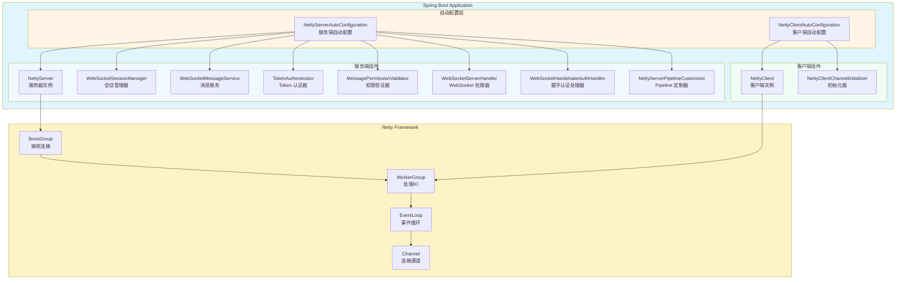
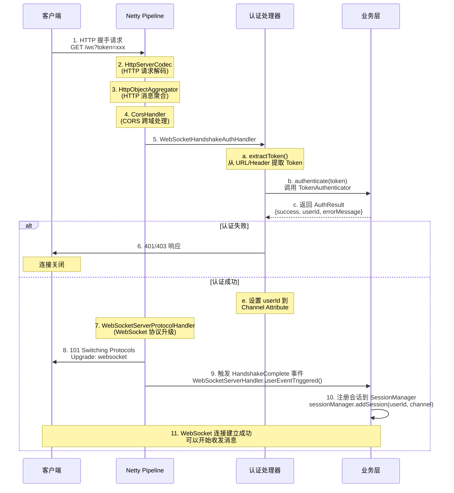
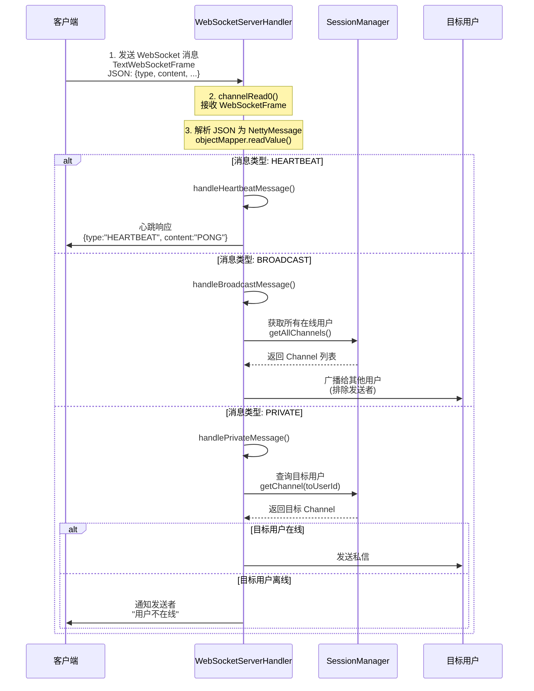
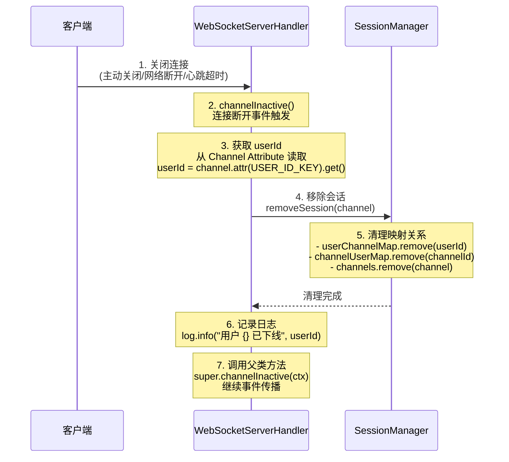
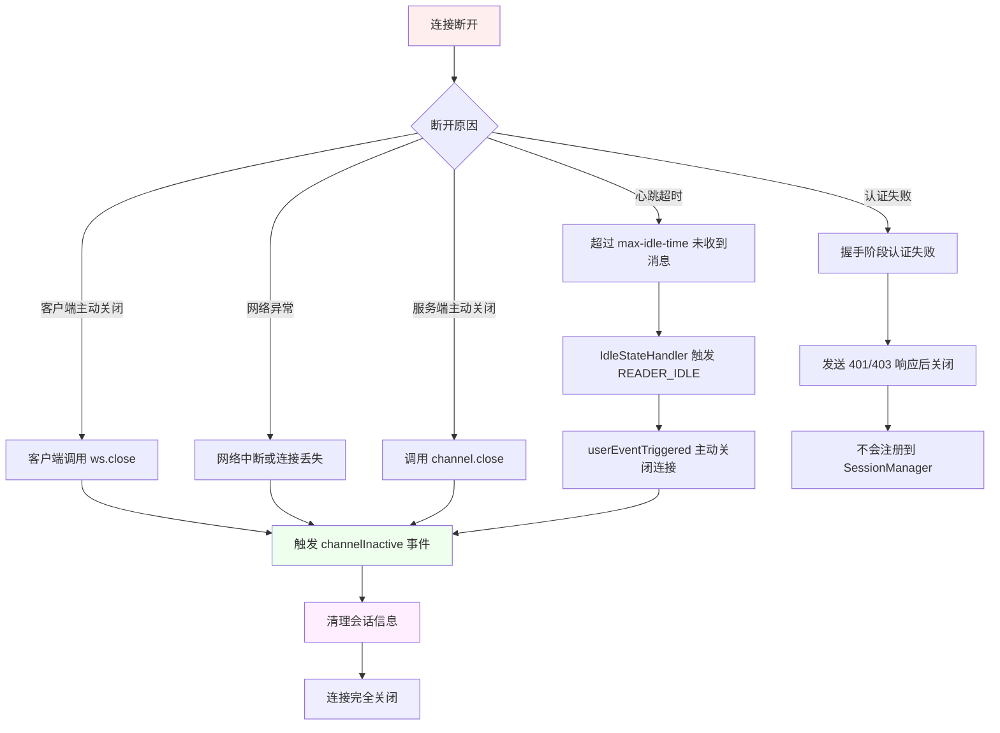
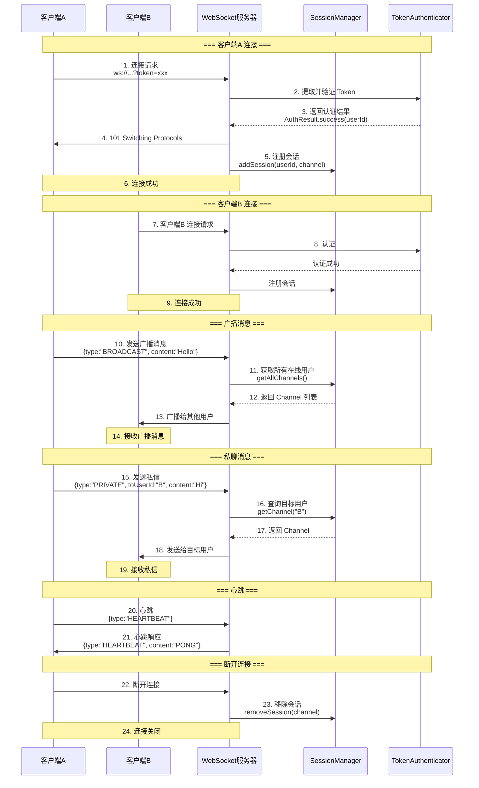
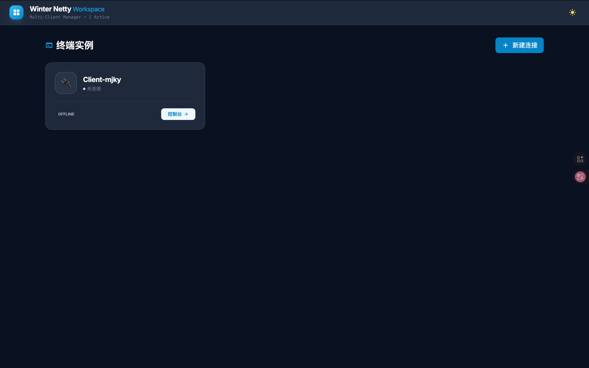
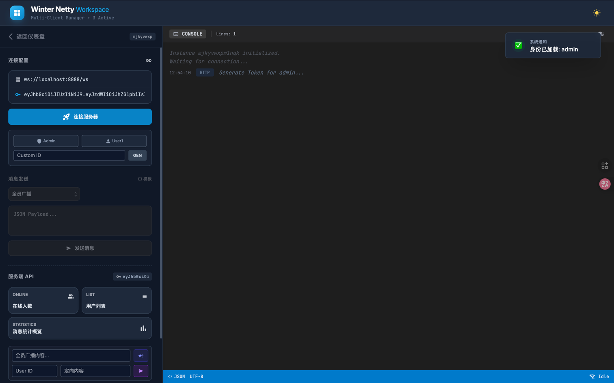
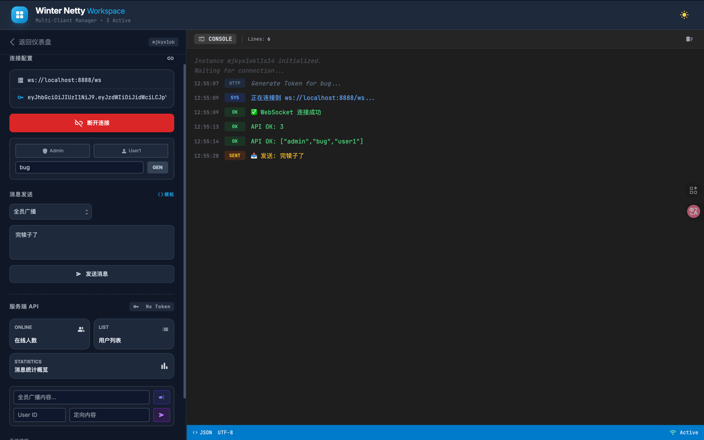
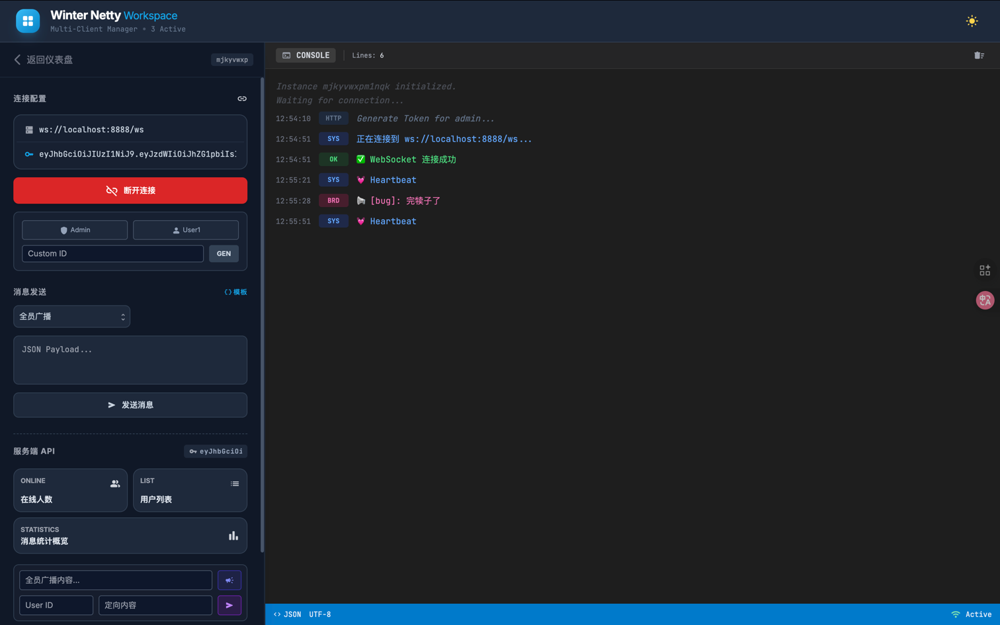

# Winter Netty Spring Boot Starter 使用文档

[](https://search.maven.org/artifact/io.github.hahaha-zsq/winter-netty-spring-boot-starter)
[](https://opensource.org/licenses/Apache-2.0)

一个基于 Netty 的 Spring Boot Starter，提供开箱即用的 WebSocket 服务端和 TCP 客户端功能。

## 特性

- 🚀 **开箱即用**：零配置启动 WebSocket 服务器和 TCP 客户端
- 🔐 **安全认证**：内置 Token 认证机制，支持握手阶段验证
- 💬 **消息类型**：支持心跳、系统消息、广播、私聊等多种消息类型
- 🔌 **会话管理**：完善的 WebSocket 会话生命周期管理
- ⚡ **高性能**：基于 Netty NIO 框架，支持高并发连接
- 🎯 **灵活扩展**：支持自定义 Pipeline、认证器、权限验证器
- 📊 **线程池隔离**：服务端和客户端独立线程池配置
- 🌐 **CORS 支持**：内置跨域资源共享配置

## 快速开始

### 1. 添加依赖

```xml
<dependency>
    <groupId>io.github.hahaha-zsq</groupId>
    <artifactId>winter-netty-spring-boot-starter</artifactId>
    <version>0.0.6</version>
</dependency>
```

### 2. 最小配置

在 `application.yml` 中添加：

```yaml
server:
  port: 8080

# Winter Netty 配置
winter-netty:
  server:
    enabled: true
    port: 8888
    boss-threads: 1
    worker-threads: 20
    websocket:
      enabled: true
      path: "/ws"
      heartbeatEnabled: true
    thread-pool:
      core-pool-size: 5
      max-pool-size: 30
      queue-capacity: 100

# 日志配置
logging:
  level:
    com.zsq: DEBUG
    io.netty: INFO
  pattern:
    console: "%d{yyyy-MM-dd HH:mm:ss.SSS} [%thread] %-5level %logger{36} - %msg%n"
```

### 3. 启动应用

```java
@SpringBootApplication
public class TestApplication {

   public static void main(String[] args) {
      SpringApplication.run(TestApplication.class, args);
   }
}
```

启动后，WebSocket 服务器将在 `ws://localhost:8888/ws` 上运行。


## 架构设计

### 整体架构图



### 核心组件说明

#### 服务端组件

| 组件 | 说明 | 可自定义 | 配置条件 |
|------|------|----------|----------|
| `NettyServer` | Netty 服务器核心类，管理服务器生命周期 | ❌ | `enable-server=true` |
| `WebSocketSessionManager` | WebSocket 会话管理器，维护用户连接映射 | ✅ | `websocket.enabled=true` |
| `TokenAuthenticator` | Token 认证器，验证用户身份 | ✅ | `websocket.enabled=true` |
| `MessagePermissionValidator` | 消息权限验证器，检查消息发送权限 | ✅ | `websocket.enabled=true` |
| `WebSocketMessageService` | 消息服务，提供消息发送 API | ✅ | `websocket.enabled=true` |
| `WebSocketServerHandler` | WebSocket 业务处理器，处理消息收发 | ✅ | `websocket.enabled=true` |
| `WebSocketHandshakeAuthHandler` | 握手认证处理器，握手阶段验证 Token | ✅ | `websocket.enabled=true` |
| `NettyServerPipelineCustomizer` | Pipeline 定制器，配置处理器链 | ✅ | `enable-server=true` |

#### 客户端组件

| 组件 | 说明 | 可自定义 | 配置条件 |
|------|------|----------|----------|
| `NettyClient` | Netty 客户端核心类，管理客户端连接 | ❌ | `enable-client=true` |
| `NettyClientChannelInitializer` | 客户端 Channel 初始化器 | ❌ | `enable-client=true` |
| `NettyClientPipelineCustomizer` | 客户端 Pipeline 定制器 | ✅ | `enable-client=true` |


## 工作流程

### WebSocket 连接建立流程图



### 关键步骤说明

1. **HTTP 握手请求**：客户端发起 WebSocket 握手，携带 Token
2. **HTTP 解码**：HttpServerCodec 将字节流解码为 HTTP 请求对象
3. **消息聚合**：HttpObjectAggregator 将分片的 HTTP 消息聚合为完整对象
4. **CORS 处理**：CorsHandler 处理跨域请求，添加必要的响应头
5. **握手认证**：WebSocketHandshakeAuthHandler 提取并验证 Token
   - 提取 Token（支持 URL 参数、Authorization Header、自定义 Header）
   - 调用 TokenAuthenticator 进行认证
   - 认证失败：返回 401/403 并关闭连接
   - 认证成功：将 userId 存储到 Channel Attribute
6. **协议升级**：WebSocketServerProtocolHandler 完成 WebSocket 握手
7. **会话注册**：握手完成后，WebSocketServerHandler 监听 HandshakeComplete 事件，将用户会话注册到 SessionManager


### 消息处理流程图



### 消息类型处理说明

#### HEARTBEAT（心跳消息）
- 客户端定期发送心跳保持连接活跃
- 服务端收到后立即响应 PONG
- 超过 `max-idle-time` 未收到心跳则断开连接

#### BROADCAST（广播消息）
- 发送给所有在线用户（除发送者自己）
- 服务端自动添加发送者信息和时间戳
- 适用于公告、系统通知等场景

#### PRIVATE（私聊消息）
- 发送给指定用户
- 需要提供 `toUserId` 字段
- 目标用户离线时通知发送者

#### SYSTEM（系统消息）
- 由服务端主动发送
- 用于系统通知、警告等


### 连接断开流程图



### 断开连接场景




## 时序图

### 完整的 WebSocket 通信时序图




## 消息格式

### NettyMessage 结构

```json
{
  "messageId": "消息唯一标识（可选）",
  "type": "消息类型: HEARTBEAT | SYSTEM | BROADCAST | PRIVATE",
  "fromUserId": "发送者ID",
  "toUserId": "接收者ID（私聊时必填）",
  "content": "消息内容",
  "token": "认证令牌（仅用于认证场景）",
  "extra": {
    "customField": "自定义扩展字段"
  },
  "timestamp": 1640000000000
}
```

### 消息类型详解

#### 1. HEARTBEAT（心跳消息）

**客户端发送：**
```json
{
  "type": "HEARTBEAT",
  "content": "PING"
}
```

**服务端响应：**
```json
{
  "type": "HEARTBEAT",
  "content": "PONG",
  "timestamp": 1640000000000
}
```

**用途：**
- 保持连接活跃
- 检测连接状态
- 防止连接被中间设备断开

#### 2. SYSTEM（系统消息）

**服务端发送：**
```json
{
  "type": "SYSTEM",
  "content": "系统维护通知：服务器将在 10 分钟后重启",
  "timestamp": 1640000000000
}
```

**用途：**
- 系统公告
- 维护通知
- 警告信息

#### 3. BROADCAST（广播消息）

**客户端发送：**
```json
{
  "type": "BROADCAST",
  "content": "大家好，我是新来的！"
}
```

**服务端转发：**
```json
{
  "type": "BROADCAST",
  "fromUserId": "user123",
  "content": "大家好，我是新来的！",
  "timestamp": 1640000000000
}
```

**用途：**
- 群聊消息
- 公告发布
- 全员通知

#### 4. PRIVATE（私聊消息）

**客户端发送：**
```json
{
  "type": "PRIVATE",
  "toUserId": "user456",
  "content": "你好，能加个好友吗？"
}
```

**服务端转发：**
```json
{
  "type": "PRIVATE",
  "fromUserId": "user123",
  "toUserId": "user456",
  "content": "你好，能加个好友吗？",
  "timestamp": 1640000000000
}
```

**用户离线时的响应：**
```json
{
  "type": "SYSTEM",
  "content": "用户 user456 不在线",
  "timestamp": 1640000000000
}
```

**用途：**
- 一对一聊天
- 私密通知
- 点对点消息


## 自定义扩展

### 1. 自定义 Token 认证器

默认的 `DefaultTokenAuthenticator` 仅用于开发环境，生产环境必须自定义实现。

#### 实现步骤

**步骤 1：创建 JWT 工具类**

```java
package com.zsq.test.utils;

import io.jsonwebtoken.Claims;
import io.jsonwebtoken.JwtException;
import io.jsonwebtoken.Jwts;
import io.jsonwebtoken.SignatureAlgorithm;
import io.jsonwebtoken.security.Keys;
import lombok.extern.slf4j.Slf4j;
import org.springframework.stereotype.Component;

import java.security.Key;
import java.util.Date;

@Slf4j
@Component
public class JwtUtils {

    // 生产环境请将密钥配置在配置文件中，且长度至少 256 位
    private static final Key KEY = Keys.secretKeyFor(SignatureAlgorithm.HS256);
    // Token 有效期：1 小时
    private static final long EXPIRATION_TIME = 3600_000;

    /**
     * 生成 Token
     */
    public String generateToken(String userId) {
        return Jwts.builder()
                .setSubject(userId)
                .setIssuedAt(new Date())
                .setExpiration(new Date(System.currentTimeMillis() + EXPIRATION_TIME))
                .signWith(KEY)
                .compact();
    }

    /**
     * 解析 Token 获取 UserId
     * @return userId 如果解析成功，返回 null 如果验证失败
     */
    public String validateAndGetUserId(String token) {
        try {
            Claims claims = Jwts.parserBuilder()
                    .setSigningKey(KEY)
                    .build()
                    .parseClaimsJws(token)
                    .getBody();
            return claims.getSubject();
        } catch (JwtException | IllegalArgumentException e) {
            log.warn("无效的 JWT Token: {}", e.getMessage());
            return null;
        }
    }
}
```

**步骤 2：创建自定义认证器**

```java
package com.zsq.test.config;

import com.zsq.test.utils.JwtUtils;
import com.zsq.winter.netty.core.websocket.TokenAuthenticator;
import lombok.RequiredArgsConstructor;
import lombok.extern.slf4j.Slf4j;
import org.springframework.stereotype.Component;

/**
 * 基于 JWT 的自定义认证器
 */
@Slf4j
@Component
@RequiredArgsConstructor
public class CustomTokenAuthenticator implements TokenAuthenticator {

    private final JwtUtils jwtUtils;

    @Override
    public AuthResult authenticate(String token) {
        // log.info("开始认证 Token: {}", token); // 生产环境建议关闭，防止日志泄露 Token

        if (token == null || token.trim().isEmpty()) {
            return AuthResult.failure("Token 不能为空");
        }

        // 使用 JwtUtils 验证并提取 UserId
        String userId = jwtUtils.validateAndGetUserId(token);

        if (userId != null) {
            return AuthResult.success(userId);
        } else {
            return AuthResult.failure("Token 无效或已过期");
        }
    }
}
```

### 2. 自定义消息权限验证器

控制用户可以发送哪些类型的消息。

```java
package com.zsq.test.config;

import com.zsq.winter.netty.core.websocket.MessagePermissionValidator;
import lombok.extern.slf4j.Slf4j;
import org.springframework.stereotype.Component;

/**
 * 自定义消息权限验证器实现
 * 
 * @author dadandiaoming
 */
@Slf4j
@Component
public class CustomMessagePermissionValidator implements MessagePermissionValidator {

    @Override
    public boolean hasPermission(String userId, Operation operation, String targetUserId) {
        log.info("检查权限 - UserId: {}, Operation: {}, TargetUser: {}", userId, operation, targetUserId);
        
        // 简单的权限检查逻辑
        switch (operation) {
            case SEND_PRIVATE_MESSAGE:
            case BROADCAST_MESSAGE:
                return true; // 所有用户都可以发送消息
            case SEND_SYSTEM_MESSAGE:
            case BROADCAST_SYSTEM_MESSAGE:
            case SEND_SYSTEM_MESSAGE_BATCH:
                return "admin".equals(userId); // 只有管理员可以发送系统消息
            default:
                return false;
        }
    }
}
```

### 3. 自定义 Pipeline 配置（TCP 服务器）

当禁用 WebSocket 时，可以自定义 TCP 服务器的 Pipeline。

```java
package com.example.pipeline;

import com.zsq.winter.netty.core.server.NettyServerPipelineCustomizer;
import io.netty.channel.ChannelPipeline;
import io.netty.handler.codec.string.StringDecoder;
import io.netty.handler.codec.string.StringEncoder;
import io.netty.handler.timeout.IdleStateHandler;
import org.springframework.stereotype.Component;

import java.util.concurrent.TimeUnit;

@Component
public class TcpServerPipelineCustomizer implements NettyServerPipelineCustomizer {
    
    @Autowired
    private CustomTcpHandler tcpHandler;
    
    @Override
    public void customize(ChannelPipeline pipeline) {
        // 1. 心跳检测
        pipeline.addLast(new IdleStateHandler(60, 0, 0, TimeUnit.SECONDS));
        
        // 2. 字符串编解码器
        pipeline.addLast(new StringDecoder());
        pipeline.addLast(new StringEncoder());
        
        // 3. 自定义业务处理器
        pipeline.addLast(tcpHandler);
    }
}
```

### 5. 使用消息服务发送消息

在业务代码中使用 `WebSocketMessageService` 发送消息。

#### 统一响应结果封装

```java
package com.zsq.test.entity;

import lombok.Data;

/**
 * 统一API响应结果封装
 */
@Data
public class Result<T> {
    private int code;
    private String message;
    private T data;

    // 成功状态码
    public static final int SUCCESS_CODE = 200;
    // 失败状态码
    public static final int ERROR_CODE = 500;

    private Result(int code, String message, T data) {
        this.code = code;
        this.message = message;
        this.data = data;
    }

    /**
     * 成功返回，带数据
     */
    public static <T> Result<T> success(T data) {
        return new Result<>(SUCCESS_CODE, "操作成功", data);
    }

    /**
     * 成功返回，自定义消息和数据
     */
    public static <T> Result<T> success(String message, T data) {
        return new Result<>(SUCCESS_CODE, message, data);
    }

    /**
     * 失败返回
     */
    public static <T> Result<T> error(String message) {
        return new Result<>(ERROR_CODE, message, null);
    }
}
```

#### WebSocket 测试控制器

```java
package com.zsq.test.controller;

import com.zsq.test.entity.Result;
import com.zsq.test.utils.JwtUtils;
import com.zsq.winter.netty.core.websocket.MessagePermissionValidator;
import com.zsq.winter.netty.core.websocket.WebSocketMessageService;
import lombok.RequiredArgsConstructor;
import lombok.extern.slf4j.Slf4j;
import org.springframework.web.bind.annotation.*;

import java.util.Arrays;
import java.util.Collection;
import java.util.concurrent.CompletableFuture;

/**
 * WebSocket测试控制器
 * 提供HTTP接口来测试WebSocket消息发送功能
 * 
 * @author dadandiaoming
 */
@Slf4j
@CrossOrigin
@RestController
@RequestMapping("/api/websocket")
@RequiredArgsConstructor
public class WebSocketTestController {

    private final WebSocketMessageService messageService;
    private final JwtUtils jwtUtils;

    /**
     * 生成测试用的 JWT Token
     */
    @GetMapping("/token/generate")
    public Result<String> generateToken(@RequestParam String userId) {
        String token = jwtUtils.generateToken(userId);
        return Result.success("Token 生成成功", token);
    }

    /**
     * 发送系统消息给指定用户
     */
    @PostMapping("/system/send")
    public Result<MessagePermissionValidator.SendResult> sendSystemMessage(
            @RequestParam String adminToken,
            @RequestParam String userId,
            @RequestParam String content) {

        log.info("发送系统消息 - adminToken: {}, userId: {}, content: {}", adminToken, userId, content);
        MessagePermissionValidator.SendResult result = messageService.sendSystemMessage(adminToken, userId, content);
        return Result.success(result);
    }

    /**
     * 发送私聊消息
     */
    @PostMapping("/private/send")
    public Result<MessagePermissionValidator.SendResult> sendPrivateMessage(
            @RequestParam String senderToken,
            @RequestParam String toUserId,
            @RequestParam String content) {

        log.info("发送私聊消息 - senderToken: {}, toUserId: {}, content: {}", senderToken, toUserId, content);
        MessagePermissionValidator.SendResult result = messageService.sendPrivateMessage(senderToken, toUserId, content);
        return Result.success(result);
    }

    /**
     * 广播系统消息
     */
    @PostMapping("/system/broadcast")
    public Result<MessagePermissionValidator.BroadcastResult> broadcastSystemMessage(
            @RequestParam String adminToken,
            @RequestParam String content,
            @RequestParam(required = false) String excludeUserId) {

        log.info("广播系统消息 - adminToken: {}, content: {}, excludeUserId: {}", adminToken, content, excludeUserId);
        MessagePermissionValidator.BroadcastResult result = messageService.broadcastSystemMessage(adminToken, content, excludeUserId);
        return Result.success(result);
    }

    /**
     * 广播普通消息
     */
    @PostMapping("/broadcast")
    public Result<MessagePermissionValidator.BroadcastResult> broadcastMessage(
            @RequestParam String senderToken,
            @RequestParam String content) {

        log.info("广播消息 - senderToken: {}, content: {}", senderToken, content);
        MessagePermissionValidator.BroadcastResult result = messageService.broadcastMessage(senderToken, content);
        return Result.success(result);
    }

    /**
     * 批量发送系统消息
     */
    @PostMapping("/system/batch")
    public Result<MessagePermissionValidator.BatchSendResult> sendSystemMessageToUsers(
            @RequestParam String adminToken,
            @RequestParam String userIds,
            @RequestParam String content) {

        Collection<String> userIdList = Arrays.asList(userIds.split(","));
        log.info("批量发送系统消息 - adminToken: {}, userIds: {}, content: {}", adminToken, userIdList, content);
        MessagePermissionValidator.BatchSendResult result = messageService.sendSystemMessageToUsers(adminToken, userIdList, content);
        return Result.success(result);
    }

    /**
     * 异步发送系统消息
     */
    @PostMapping("/system/send/async")
    public CompletableFuture<Result<MessagePermissionValidator.SendResult>> sendSystemMessageAsync(
            @RequestParam String adminToken,
            @RequestParam String userId,
            @RequestParam String content) {

        log.info("异步发送系统消息 - adminToken: {}, userId: {}, content: {}", adminToken, userId, content);
        return messageService.sendSystemMessageAsync(adminToken, userId, content)
                .thenApply(Result::success);
    }

    /**
     * 异步发送私聊消息
     */
    @PostMapping("/private/send/async")
    public CompletableFuture<Result<MessagePermissionValidator.SendResult>> sendPrivateMessageAsync(
            @RequestParam String senderToken,
            @RequestParam String toUserId,
            @RequestParam String content) {

        log.info("异步发送私聊消息 - senderToken: {}, toUserId: {}, content: {}", senderToken, toUserId, content);
        return messageService.sendPrivateMessageAsync(senderToken, toUserId, content)
                .thenApply(Result::success);
    }

    /**
     * 获取在线用户数量
     */
    @GetMapping("/online/count")
    public Result<Integer> getOnlineCount() {
        int count = messageService.getOnlineCount();
        return Result.success(count);
    }

    /**
     * 检查用户是否在线
     */
    @GetMapping("/online/check")
    public Result<Boolean> isUserOnline(@RequestParam String userId) {
        boolean online = messageService.isUserOnline(userId);
        return Result.success(online);
    }

    /**
     * 获取所有在线用户ID
     */
    @GetMapping("/online/users")
    public Result<Collection<String>> getOnlineUserIds() {
        Collection<String> userIds = messageService.getOnlineUserIds();
        return Result.success(userIds);
    }

    /**
     * 获取消息统计信息
     */
    @GetMapping("/statistics")
    public Result<MessagePermissionValidator.MessageStatistics> getMessageStatistics() {
        MessagePermissionValidator.MessageStatistics stats = messageService.getMessageStatistics();
        return Result.success(stats);
    }

    /**
     * 清空消息缓存
     */
    @PostMapping("/cache/clear")
    public Result<String> clearMessageCache() {
        messageService.clearMessageCache();
        return Result.success("消息缓存已清空", null);
    }

    /**
     * 重置统计信息
     */
    @PostMapping("/statistics/reset")
    public Result<String> resetStatistics() {
        messageService.resetStatistics();
        return Result.success("统计信息已重置", null);
    }

    /**
     * 清理频率限制器
     */
    @PostMapping("/ratelimiter/cleanup")
    public Result<String> cleanupRateLimiters() {
        messageService.cleanupRateLimiters();
        return Result.success("频率限制器已清理", null);
    }
}
```

## 配置说明

### 完整配置示例

```yaml
winter-netty:
  # ==================== 全局配置 ====================
  # 是否启用服务端组件
  enable-server: true
  # 是否启用客户端组件
  enable-client: false
  
  # ==================== 服务端配置 ====================
  server:
    # 服务端口
    port: 8888
    # Boss 线程数（接收连接）
    boss-threads: 5
    # Worker 线程数（处理IO），0 表示使用 CPU 核心数 * 2
    worker-threads: 0
    
    # WebSocket 配置
    websocket:
      # 是否启用 WebSocket 功能
      enabled: true
      # WebSocket 访问路径
      path: /ws
      # 是否启用心跳检测
      heartbeat-enabled: true
      # 心跳间隔（秒）
      heartbeat-interval: 30
      # 最大空闲时间（秒），超过此时间未收到消息则断开连接
      max-idle-time: 90
      # 最大连接数限制
      max-connections: 1000
    
    # 服务端线程池配置
    thread-pool:
      # 核心线程数
      core-pool-size: 1
      # 最大线程数
      max-pool-size: 10
      # 任务队列容量
      queue-capacity: 50
      # 线程空闲超时时间（秒）
      keep-alive-seconds: 10
      # 线程名称前缀
      name-prefix: winterNettyAsyncExecutor -
      # 关闭前等待时间（秒）
      await-termination-seconds: 60
      # 是否等待所有任务完成后再关闭
      wait-for-tasks-to-complete-on-shutdown: true
  
  # ==================== 客户端配置 ====================
  client:
    # 服务器地址
    host: localhost
    # 服务器端口
    port: 8889
    
    # 客户端线程池配置
    thread-pool:
      core-pool-size: 1
      max-pool-size: 10
      queue-capacity: 50
      keep-alive-seconds: 10
      name-prefix: winterNettyAsyncExecutor -
      await-termination-seconds: 60
      wait-for-tasks-to-complete-on-shutdown: true
```

### 配置项详解

#### 服务端配置

| 配置项 | 类型 | 默认值 | 说明 |
|--------|------|--------|------|
| `winter-netty.enable-server` | boolean | `true` | 是否启用服务端组件 |
| `winter-netty.server.port` | int | `8888` | 服务端口号 |
| `winter-netty.server.boss-threads` | int | `5` | Boss 线程组线程数，用于接收连接 |
| `winter-netty.server.worker-threads` | int | `0` | Worker 线程组线程数，0 表示 CPU 核心数 * 2 |

#### WebSocket 配置

| 配置项 | 类型 | 默认值 | 说明 |
|--------|------|--------|------|
| `winter-netty.server.websocket.enabled` | boolean | `false` | 是否启用 WebSocket 功能 |
| `winter-netty.server.websocket.path` | String | `/ws` | WebSocket 访问路径 |
| `winter-netty.server.websocket.heartbeat-enabled` | boolean | `true` | 是否启用心跳检测 |
| `winter-netty.server.websocket.heartbeat-interval` | int | `30` | 心跳间隔（秒） |
| `winter-netty.server.websocket.max-idle-time` | int | `90` | 最大空闲时间（秒） |
| `winter-netty.server.websocket.max-connections` | int | `1000` | 最大连接数限制 |

#### 线程池配置

| 配置项 | 类型 | 默认值 | 说明 |
|--------|------|--------|------|
| `thread-pool.core-pool-size` | int | `1` | 核心线程数 |
| `thread-pool.max-pool-size` | int | `10` | 最大线程数 |
| `thread-pool.queue-capacity` | int | `50` | 任务队列容量 |
| `thread-pool.keep-alive-seconds` | int | `10` | 线程空闲超时时间（秒） |
| `thread-pool.name-prefix` | String | `winterNettyAsyncExecutor -` | 线程名称前缀 |
| `thread-pool.await-termination-seconds` | int | `60` | 关闭前等待时间（秒） |
| `thread-pool.wait-for-tasks-to-complete-on-shutdown` | boolean | `true` | 是否等待任务完成后再关闭 |

#### 客户端配置

| 配置项 | 类型 | 默认值 | 说明 |
|--------|------|--------|------|
| `winter-netty.enable-client` | boolean | `false` | 是否启用客户端组件 |
| `winter-netty.client.host` | String | `localhost` | 服务器地址 |
| `winter-netty.client.port` | int | `8889` | 服务器端口 |

### 不同场景的配置示例

#### 场景 1：仅启用 WebSocket 服务器

```yaml
winter-netty:
  enable-server: true
  server:
    port: 8888
    websocket:
      enabled: true
      path: /ws
```

#### 场景 2：启用 TCP 服务器（禁用 WebSocket）

```yaml
winter-netty:
  enable-server: true
  server:
    port: 8888
    websocket:
      enabled: false
```

需要提供自定义的 `NettyServerPipelineCustomizer` 实现。

#### 场景 3：仅启用客户端

```yaml
winter-netty:
  enable-server: false
  enable-client: true
  client:
    host: 192.168.1.100
    port: 8889
```

#### 场景 4：同时启用服务端和客户端

```yaml
winter-netty:
  enable-server: true
  enable-client: true
  server:
    port: 8888
    websocket:
      enabled: true
  client:
    host: 192.168.1.100
    port: 8889
```

#### 场景 5：高并发配置

```yaml
winter-netty:
  server:
    port: 8888
    boss-threads: 10
    worker-threads: 20
    websocket:
      enabled: true
      max-connections: 10000
      max-idle-time: 120
    thread-pool:
      core-pool-size: 10
      max-pool-size: 50
      queue-capacity: 200
```


## 容器加载说明

### Bean 加载机制

本项目使用 Spring Boot 的自动配置机制，通过 `@ConditionalOnProperty` 和 `@ConditionalOnMissingBean` 注解控制 Bean 的加载。

### 不同配置下的 Bean 加载

#### 1. 仅启用服务端（默认配置）

**配置：**
```yaml
winter-netty:
  enable-server: true
  enable-client: false
```

**加载的 Bean：**

| Bean 名称 | 类型 | 说明 |
|-----------|------|------|
| `winterNettyServerTaskExecutor` | ThreadPoolTaskExecutor | 服务端线程池 |
| `nettyServerChannelInitializer` | NettyServerChannelInitializer | 服务端 Channel 初始化器 |
| `defaultNettyServerPipelineCustomizer` | DefaultNettyServerPipelineCustomizer | 默认 Pipeline 定制器 |
| `nettyServer` | NettyServer | Netty 服务器实例 |

**说明：**
- 此配置下只加载基础的 TCP 服务器组件
- 不加载 WebSocket 相关组件
- 需要自定义 `NettyServerPipelineCustomizer` 来配置 TCP 协议处理

#### 2. 启用服务端 + WebSocket

**配置：**
```yaml
winter-netty:
  enable-server: true
  server:
    websocket:
      enabled: true
```

**加载的 Bean：**

| Bean 名称 | 类型 | 说明 |
|-----------|------|------|
| `winterNettyServerTaskExecutor` | ThreadPoolTaskExecutor | 服务端线程池 |
| `webSocketSessionManager` | WebSocketSessionManager | WebSocket 会话管理器 |
| `defaultTokenAuthenticator` | DefaultTokenAuthenticator | 默认 Token 认证器 |
| `defaultMessagePermissionValidator` | DefaultMessagePermissionValidator | 默认权限验证器 |
| `webSocketMessageService` | WebSocketMessageService | 消息服务 |
| `webSocketServerHandler` | WebSocketServerHandler | WebSocket 处理器 |
| `webSocketHandshakeAuthHandler` | WebSocketHandshakeAuthHandler | 握手认证处理器 |
| `webSocketPipelineCustomizer` | WebSocketPipelineCustomizer | WebSocket Pipeline 定制器 |
| `nettyServerChannelInitializer` | NettyServerChannelInitializer | 服务端 Channel 初始化器 |
| `nettyServer` | NettyServer | Netty 服务器实例 |

**说明：**
- 加载完整的 WebSocket 服务器组件
- 包含会话管理、认证、权限验证等功能
- 默认认证器和权限验证器仅用于开发环境

#### 3. 仅启用客户端

**配置：**
```yaml
winter-netty:
  enable-server: false
  enable-client: true
```

**加载的 Bean：**

| Bean 名称 | 类型 | 说明 |
|-----------|------|------|
| `winterNettyClientTaskExecutor` | ThreadPoolTaskExecutor | 客户端线程池 |
| `nettyClientChannelInitializer` | NettyClientChannelInitializer | 客户端 Channel 初始化器 |
| `nettyClient` | NettyClient | Netty 客户端实例 |

**说明：**
- 只加载客户端组件
- 不加载任何服务端组件
- 需要自定义 `NettyClientPipelineCustomizer` 来配置客户端协议处理

#### 4. 同时启用服务端和客户端

**配置：**
```yaml
winter-netty:
  enable-server: true
  enable-client: true
  server:
    websocket:
      enabled: true
```

**加载的 Bean：**
- 所有服务端 Bean（包括 WebSocket 相关）
- 所有客户端 Bean

**说明：**
- 服务端和客户端使用独立的线程池
- 可以同时作为服务器和客户端运行

### Bean 覆盖规则

所有标记为 `@ConditionalOnMissingBean` 的 Bean 都可以被自定义实现覆盖。

#### 可覆盖的 Bean

| Bean 类型 | 默认实现 | 自定义方式 |
|-----------|----------|------------|
| `TokenAuthenticator` | DefaultTokenAuthenticator | 创建 @Component 实现 TokenAuthenticator 接口 |
| `MessagePermissionValidator` | DefaultMessagePermissionValidator | 创建 @Component 实现 MessagePermissionValidator 接口 |
| `WebSocketSessionManager` | WebSocketSessionManager | 创建 @Component 继承或实现 |
| `WebSocketMessageService` | WebSocketMessageService | 创建 @Component 继承或实现 |
| `WebSocketServerHandler` | WebSocketServerHandler | 创建 @Component 继承 |
| `WebSocketHandshakeAuthHandler` | WebSocketHandshakeAuthHandler | 创建 @Component 继承 |
| `NettyServerPipelineCustomizer` | WebSocketPipelineCustomizer / DefaultNettyServerPipelineCustomizer | 创建 @Component 实现接口 |
| `NettyClientPipelineCustomizer` | 无默认实现 | 创建 @Component 实现接口 |

#### 覆盖示例

```java
// 自定义 Token 认证器会自动替换默认实现
@Component
public class MyTokenAuthenticator implements TokenAuthenticator {
    @Override
    public AuthResult authenticate(String token) {
        // 自定义认证逻辑
        return AuthResult.success("userId");
    }
}
```

### Bean 加载顺序

```
1. NettyProperties (配置属性)
   ↓
2. ThreadPoolTaskExecutor (线程池)
   ↓
3. WebSocketSessionManager (会话管理器)
   ↓
4. TokenAuthenticator (认证器)
   ↓
5. MessagePermissionValidator (权限验证器)
   ↓
6. WebSocketMessageService (消息服务)
   ↓
7. WebSocketServerHandler (处理器)
   ↓
8. WebSocketHandshakeAuthHandler (握手认证)
   ↓
9. NettyServerPipelineCustomizer (Pipeline 定制器)
   ↓
10. NettyServerChannelInitializer (初始化器)
    ↓
11. NettyServer (服务器实例)
```

### 条件注解说明

#### @ConditionalOnProperty

控制整个配置类是否生效：

```java
@ConditionalOnProperty(
    prefix = "winter-netty", 
    name = "enable-server", 
    havingValue = "true", 
    matchIfMissing = true
)
```

- `prefix`: 配置前缀
- `name`: 配置名称
- `havingValue`: 期望的值
- `matchIfMissing`: 配置不存在时是否匹配（默认行为）

#### @ConditionalOnMissingBean

当容器中不存在指定 Bean 时才创建：

```java
@Bean
@ConditionalOnMissingBean(TokenAuthenticator.class)
public TokenAuthenticator defaultTokenAuthenticator() {
    return new DefaultTokenAuthenticator();
}
```

这允许用户通过创建自定义 Bean 来覆盖默认实现。


## 客户端连接示例

### JavaScript / TypeScript 客户端

```javascript
<html class="light dark" lang="zh-CN"><head>
    <meta charset="utf-8">
    <meta content="width=device-width, initial-scale=1.0" name="viewport">
    <title>Winter Netty 多路复用终端</title>
    <script src="https://cdn.tailwindcss.com"></script>
    <link href="https://fonts.googleapis.com/css2?family=Inter:wght@300;400;500;600;700&amp;family=JetBrains+Mono:wght@400;500;700&amp;display=swap" rel="stylesheet">
    <link href="https://fonts.googleapis.com/css2?family=Material+Symbols+Rounded:opsz,wght,FILL,GRAD@24,400,1,0" rel="stylesheet">
    <script>
        tailwind.config = {
            darkMode: 'class',
            theme: {
                extend: {
                    fontFamily: {
                        sans: ['Inter', 'sans-serif'],
                        mono: ['JetBrains Mono', 'monospace'],
                    },
                    colors: {
                        winter: {
                            50: '#f0f9ff', 100: '#e0f2fe', 200: '#bae6fd', 300: '#7dd3fc',
                            400: '#38bdf8', 500: '#0ea5e9', 600: '#0284c7', 700: '#0369a1',
                            800: '#075985', 900: '#0c4a6e',
                        }
                    },
                    animation: {
                        'fade-in-up': 'fadeInUp 0.3s ease-out forwards',
                        'pulse-slow': 'pulse 3s cubic-bezier(0.4, 0, 0.6, 1) infinite',
                    },
                    keyframes: {
                        fadeInUp: {
                            '0%': { opacity: '0', transform: 'translateY(10px)' },
                            '100%': { opacity: '1', transform: 'translateY(0)' },
                        }
                    }
                }
            }
        }
    </script>
    <style>
        /* 滚动条美化 */
        .custom-scrollbar::-webkit-scrollbar { width: 5px; height: 5px; }
        .custom-scrollbar::-webkit-scrollbar-track { background: transparent; }
        .custom-scrollbar::-webkit-scrollbar-thumb { background: #cbd5e1; border-radius: 10px; }
        .dark .custom-scrollbar::-webkit-scrollbar-thumb { background: #475569; }

        .terminal-scroll::-webkit-scrollbar { width: 6px; }
        .terminal-scroll::-webkit-scrollbar-track { background: transparent; }
        .terminal-scroll::-webkit-scrollbar-thumb { background: #d1d5db; border-radius: 3px; }
        .dark .terminal-scroll::-webkit-scrollbar-track { background: #1e1e1e; }
        .dark .terminal-scroll::-webkit-scrollbar-thumb { background: #4b5563; }

        .material-symbols-rounded { font-size: 20px; vertical-align: middle; }

        /* 全局过渡 */
        body, div, nav, aside, header, input, select, textarea, button, section, span {
            transition-property: background-color, border-color, color, fill, stroke, box-shadow, transform, opacity;
            transition-timing-function: cubic-bezier(0.4, 0, 0.2, 1);
            transition-duration: 200ms;
        }

        /* --- View Transition 修复核心代码 Start --- */
        ::view-transition-old(root),
        ::view-transition-new(root) {
            animation: none;       /* 禁用默认的淡入淡出动画 */
            mix-blend-mode: normal; /* 确保颜色混合模式正常 */
        }

        ::view-transition-new(root) {
            z-index: 9999; /* 新视图在上，确保 clip-path 能够像遮罩一样展示新内容 */
        }

        ::view-transition-old(root) {
            z-index: 1;    /* 旧视图在下 */
        }

        /* 适配 Dark 模式层级 */
        .dark::view-transition-old(root) { z-index: 1; }
        .dark::view-transition-new(root) { z-index: 9999; }
        /* --- View Transition 修复核心代码 End --- */

        /* 按钮交互微动效 */
        .btn-bounce:active { transform: scale(0.95); }
    </style>
</head>
<body class="bg-gray-100 text-slate-600 h-screen flex flex-col overflow-hidden dark:bg-[#0b1121] dark:text-slate-300">
<header class="h-16 bg-white border-b border-gray-200 flex justify-between items-center px-6 shadow-sm z-30 shrink-0 dark:bg-[#1e293b] dark:border-slate-700">
    <div class="flex items-center gap-4">
        <div class="bg-gradient-to-br from-winter-400 to-winter-600 p-2 rounded-xl shadow-lg shadow-winter-500/20 cursor-pointer hover:scale-105 transition-transform" onclick="app.showDashboard()">
            <span class="material-symbols-rounded text-white">grid_view</span>
        </div>
        <div>
            <h1 class="font-bold text-gray-900 text-lg leading-tight tracking-tight dark:text-white">Winter Netty <span class="text-winter-500 text-base font-normal">Workspace</span></h1>
            <div class="flex items-center gap-2 text-[11px] font-mono text-gray-400 dark:text-slate-500">
                <span>Multi-Client Manager</span>
                <span class="w-1 h-1 rounded-full bg-gray-300 dark:bg-slate-600"></span>
                <span id="active-count">0 Active</span>
            </div>
        </div>
    </div>
    <div class="flex items-center gap-4">
        <button class="relative p-2 rounded-lg text-gray-500 hover:bg-gray-100 dark:text-slate-400 dark:hover:bg-slate-700 dark:hover:text-slate-200 transition-all overflow-hidden group focus:outline-none btn-bounce" onclick="app.toggleTheme(event)">
            <span class="material-symbols-rounded relative z-10 block dark:hidden group-hover:rotate-12 transition-transform">dark_mode</span>
            <span class="material-symbols-rounded relative z-10 hidden dark:block text-amber-300 group-hover:rotate-12 transition-transform">light_mode</span>
        </button>
    </div>
</header>

<main class="flex-1 relative overflow-hidden">
    <div class="absolute inset-0 p-8 overflow-y-auto z-10 bg-gray-50/50 dark:bg-[#0b1121]" id="dashboard-view">
        <div class="max-w-7xl mx-auto">
            <div class="flex justify-between items-center mb-6">
                <h2 class="text-2xl font-bold text-gray-800 dark:text-white flex items-center gap-2">
                    <span class="material-symbols-rounded text-winter-500">terminal</span> 终端实例
                </h2>
                <button class="flex items-center gap-2 px-4 py-2 bg-winter-600 hover:bg-winter-500 text-white rounded-lg shadow-md hover:shadow-xl transition-all btn-bounce" onclick="app.createInstance()">
                    <span class="material-symbols-rounded">add</span>
                    <span>新建连接</span>
                </button>
            </div>
            <div class="grid grid-cols-1 md:grid-cols-2 lg:grid-cols-3 gap-6" id="instance-grid"></div>
            <div class="flex flex-col items-center justify-center py-20 opacity-50" id="empty-state">
                <div class="w-20 h-20 bg-gray-200 dark:bg-slate-800 rounded-full flex items-center justify-center mb-4">
                    <span class="material-symbols-rounded text-4xl text-gray-400">power_off</span>
                </div>
                <p class="text-gray-500 dark:text-slate-500">暂无活跃连接，点击右上角添加</p>
            </div>
        </div>
    </div>

    <div class="absolute inset-0 bg-white dark:bg-[#0b1121] z-20 hidden" id="workspace-container"></div>
</main>

<div class="fixed top-20 right-8 bg-white/90 dark:bg-slate-800/90 backdrop-blur border border-gray-200 dark:border-slate-700 text-gray-800 dark:text-white pl-4 pr-6 py-3 rounded-lg shadow-2xl transform transition-all duration-300 translate-x-20 opacity-0 z-50 text-sm flex items-center gap-3 max-w-sm pointer-events-none" id="toast">
    <div class="w-8 h-8 rounded-full bg-gray-100 dark:bg-white/10 flex items-center justify-center shrink-0 transition-colors" id="toast-icon-bg">
        <span class="text-lg" id="toast-icon">ℹ️</span>
    </div>
    <div class="flex flex-col min-w-[150px]">
        <span class="text-[10px] uppercase tracking-wider text-gray-400 dark:text-slate-400 font-bold">系统通知</span>
        <span class="font-medium leading-tight" id="toast-msg">Message</span>
    </div>
</div>

<script>
    const API_BASE = 'http://127.0.0.1:8080/api/websocket';

    class TerminalInstance {
        constructor(id, manager) {
            this.id = id;
            this.manager = manager;
            this.name = `Client-${id.substring(0, 4)}`;
            this.ws = null;
            this.wsUrl = 'ws://localhost:8888/ws';
            this.token = '';
            this.userId = '';
            this.heartbeatInterval = null;
            this.logs = [];
            this.logCounter = 0;
            this.destroyed = false; // 新增销毁标记

            this.el = null;
            this.cardEl = null;

            this.render();
            this.renderCard();
        }

        // 渲染仪表盘卡片
        renderCard() {
            const div = document.createElement('div');
            div.className = "bg-white dark:bg-[#1e293b] rounded-2xl p-6 border border-gray-200 dark:border-slate-700 shadow-sm hover:shadow-xl hover:-translate-y-1 transition-all group relative overflow-hidden animate-fade-in-up";
            div.id = `card-${this.id}`;
            div.innerHTML = `
                    <div class="absolute top-0 right-0 p-3 opacity-0 group-hover:opacity-100 transition-opacity z-10">
                        <button class="w-8 h-8 rounded-full bg-red-50 hover:bg-red-100 text-red-500 flex items-center justify-center transition-colors js-close-card" title="关闭实例">
                            <span class="material-symbols-rounded text-lg">close</span>
                        </button>
                    </div>
                    <div class="flex items-center gap-4 mb-5">
                        <div class="w-14 h-14 rounded-2xl bg-gray-50 dark:bg-slate-700/50 border border-gray-100 dark:border-slate-600 flex items-center justify-center text-2xl transition-colors js-status-icon group-hover:scale-110 duration-300">🔌</div>
                        <div>
                            <h3 class="font-bold text-gray-800 dark:text-white text-lg js-card-name tracking-tight">${this.name}</h3>
                            <p class="text-xs text-gray-400 dark:text-slate-500 font-mono mt-0.5 flex items-center gap-1">
                                <span class="w-1.5 h-1.5 rounded-full bg-gray-300 js-card-dot"></span>
                                <span class="js-card-uid">未连接</span>
                            </p>
                        </div>
                    </div>
                    <div class="flex justify-between items-center pt-4 border-t border-gray-50 dark:border-slate-700/50">
                        <span class="text-[10px] font-bold px-2 py-1 rounded bg-gray-100 dark:bg-slate-800 text-gray-400 js-status-badge">OFFLINE</span>
                        <button class="px-4 py-1.5 bg-winter-50 text-winter-600 border border-winter-100 rounded-lg text-xs font-bold hover:bg-winter-500 hover:text-white hover:border-winter-500 transition-all shadow-sm js-open-btn flex items-center gap-1 group/btn">
                            控制台 <span class="material-symbols-rounded text-[14px] group-hover/btn:translate-x-0.5 transition-transform">arrow_forward</span>
                        </button>
                    </div>
                `;
            div.querySelector('.js-open-btn').onclick = () => this.manager.switchToInstance(this.id);
            div.querySelector('.js-close-card').onclick = (e) => {
                e.stopPropagation();
                this.manager.removeInstance(this.id);
            };
            this.cardEl = div;
        }

        // 渲染工作区
        render() {
            const container = document.createElement('div');
            container.className = "flex h-full w-full hidden";
            container.id = `instance-${this.id}`;
            container.innerHTML = `
                    <aside class="w-[400px] bg-white border-r border-gray-200 flex flex-col z-20 shadow-xl dark:bg-[#111827] dark:border-slate-800">
                        <div class="p-4 border-b border-gray-100 dark:border-slate-800 flex items-center justify-between bg-gray-50/80 dark:bg-[#111827] backdrop-blur">
                            <button class="flex items-center gap-1 text-gray-500 hover:text-winter-600 dark:hover:text-white text-sm font-medium transition-colors js-back-btn btn-bounce">
                                <span class="material-symbols-rounded">arrow_back_ios_new</span> 返回仪表盘
                            </button>
                            <span class="text-[10px] font-mono text-gray-400 bg-gray-100 dark:bg-slate-800 px-2 py-0.5 rounded">${this.id.substring(0,8)}</span>
                        </div>

                        <div class="flex-1 overflow-y-auto custom-scrollbar p-5 space-y-6">
                            <div class="space-y-3">
                                <div class="flex items-center justify-between text-xs font-bold text-gray-400 uppercase tracking-wider">
                                    <span>连接配置</span>
                                    <span class="material-symbols-rounded text-base text-gray-300">link</span>
                                </div>
                                <div class="bg-white border border-gray-200 rounded-xl p-1 dark:bg-slate-800/50 dark:border-slate-700 shadow-sm transition-shadow focus-within:shadow-md focus-within:border-winter-300">
                                    <div class="flex items-center px-3 py-2 border-b border-gray-100 dark:border-slate-700/50">
                                        <span class="text-gray-400 material-symbols-rounded text-sm mr-2">dns</span>
                                        <input class="w-full bg-transparent text-xs font-mono text-gray-700 focus:outline-none dark:text-slate-300 placeholder-gray-400 js-ws-url" type="text" value="${this.wsUrl}"/>
                                    </div>
                                    <div class="flex items-center px-3 py-2">
                                        <span class="text-winter-500 material-symbols-rounded text-sm mr-2">key</span>
                                        <input class="w-full bg-transparent text-xs font-mono text-gray-700 focus:outline-none dark:text-slate-300 placeholder-gray-400 js-ws-token" placeholder="Token..." type="text"/>
                                    </div>
                                </div>
                                <button class="w-full py-2.5 bg-gray-900 hover:bg-gray-800 text-white rounded-lg shadow-md transition-all font-medium text-xs flex justify-center items-center gap-2 dark:bg-winter-600 dark:hover:bg-winter-500 btn-bounce js-connect-btn">
                                    <span class="material-symbols-rounded">rocket_launch</span>
                                    <span>连接服务器</span>
                                </button>

                                <div class="bg-gray-50 border border-gray-100 rounded-lg p-3 dark:bg-slate-800/50 dark:border-slate-700">
                                    <div class="flex gap-2 mb-2">
                                        <button class="flex-1 py-1.5 bg-white border border-gray-200 text-gray-600 rounded text-[10px] hover:border-purple-300 hover:text-purple-600 shadow-sm transition-all dark:bg-slate-800 dark:border-slate-600 dark:text-slate-400 dark:hover:text-purple-300 js-quick-admin">
                                            <span class="material-symbols-rounded text-[14px] align-middle">shield</span> Admin
                                        </button>
                                        <button class="flex-1 py-1.5 bg-white border border-gray-200 text-gray-600 rounded text-[10px] hover:border-blue-300 hover:text-blue-600 shadow-sm transition-all dark:bg-slate-800 dark:border-slate-600 dark:text-slate-400 dark:hover:text-blue-300 js-quick-user">
                                            <span class="material-symbols-rounded text-[14px] align-middle">person</span> User1
                                        </button>
                                    </div>
                                    <div class="flex gap-2">
                                        <input class="flex-1 bg-white border border-gray-200 rounded px-2 py-1 text-xs outline-none focus:border-winter-400 dark:bg-slate-900 dark:border-slate-600 dark:text-slate-300 js-custom-uid" placeholder="Custom ID" type="text"/>
                                        <button class="px-3 bg-gray-200 text-gray-600 text-[10px] font-bold rounded hover:bg-gray-300 dark:bg-slate-700 dark:text-slate-300 js-gen-token">GEN</button>
                                    </div>
                                </div>
                            </div>

                            <div class="space-y-3 opacity-50 pointer-events-none transition-all duration-300 grayscale js-send-area">
                                <div class="flex items-center justify-between text-xs font-bold text-gray-400 uppercase tracking-wider">
                                    <span>消息发送</span>
                                    <button class="text-winter-500 hover:text-winter-600 text-[10px] normal-case font-medium flex items-center gap-0.5 hover:underline js-tpl-btn">
                                        <span class="material-symbols-rounded text-[12px]">data_object</span> 模板
                                    </button>
                                </div>
                                <div class="flex gap-2">
                                    <div class="relative w-1/2">
                                        <select class="w-full appearance-none bg-gray-50 border border-gray-200 text-gray-700 text-xs rounded-lg py-2 pl-2 pr-6 focus:outline-none focus:border-winter-500 dark:bg-slate-800 dark:border-slate-700 dark:text-slate-300 js-msg-type">
                                            <option value="BROADCAST">全员广播</option>
                                            <option value="PRIVATE">私聊单推</option>
                                        </select>
                                        <span class="material-symbols-rounded text-gray-400 text-sm absolute right-1 top-2 pointer-events-none">unfold_more</span>
                                    </div>
                                    <input class="w-1/2 bg-white border border-gray-200 text-gray-700 text-xs rounded-lg px-2 hidden focus:outline-none focus:border-winter-500 dark:bg-slate-800 dark:border-slate-700 dark:text-slate-300 js-target-id" placeholder="Target ID"/>
                                </div>
                                <textarea class="w-full bg-white border border-gray-200 rounded-lg p-3 text-xs font-mono focus:outline-none focus:border-winter-500 resize-none dark:bg-slate-800 dark:border-slate-700 dark:text-slate-300 transition-colors js-msg-content" rows="3" placeholder="JSON Payload..."></textarea>
                                <button class="w-full py-2 bg-white border border-gray-200 text-gray-600 rounded-lg text-xs font-semibold shadow-sm hover:bg-gray-50 hover:text-winter-600 hover:border-winter-200 transition-all flex justify-center items-center gap-2 dark:bg-slate-800 dark:border-slate-700 dark:text-slate-300 dark:hover:bg-slate-700 btn-bounce js-send-btn">
                                    <span class="material-symbols-rounded text-sm">send</span> 发送消息
                                </button>
                            </div>

                            <div class="space-y-4 pt-4 border-t border-dashed border-gray-200 dark:border-slate-700">
                                <div class="flex items-center justify-between text-xs font-bold text-gray-400 uppercase tracking-wider">
                                    <span>服务端 API</span>
                                    <div class="flex items-center gap-1 bg-gray-100 dark:bg-slate-800 px-2 py-0.5 rounded">
                                        <span class="material-symbols-rounded text-[12px] text-gray-400">vpn_key</span>
                                        <input class="w-16 bg-transparent text-[10px] text-right focus:outline-none dark:text-slate-400 font-mono js-admin-token" placeholder="No Token" readonly/>
                                    </div>
                                </div>

                                <div class="grid grid-cols-2 gap-2">
                                    <button class="p-2.5 bg-white border border-gray-200 rounded-xl text-left hover:border-winter-400 hover:shadow-sm transition-all group dark:bg-slate-800 dark:border-slate-700 js-api-online-count btn-bounce">
                                        <div class="flex justify-between items-start">
                                            <span class="text-[10px] text-gray-400 group-hover:text-winter-500 uppercase font-bold">Online</span>
                                            <span class="material-symbols-rounded text-base text-gray-300 group-hover:text-winter-400">group</span>
                                        </div>
                                        <div class="text-xs font-bold mt-1 dark:text-slate-200">在线人数</div>
                                    </button>
                                    <button class="p-2.5 bg-white border border-gray-200 rounded-xl text-left hover:border-winter-400 hover:shadow-sm transition-all group dark:bg-slate-800 dark:border-slate-700 js-api-online-users btn-bounce">
                                        <div class="flex justify-between items-start">
                                            <span class="text-[10px] text-gray-400 group-hover:text-winter-500 uppercase font-bold">List</span>
                                            <span class="material-symbols-rounded text-base text-gray-300 group-hover:text-winter-400">list</span>
                                        </div>
                                        <div class="text-xs font-bold mt-1 dark:text-slate-200">用户列表</div>
                                    </button>
                                    <button class="col-span-2 p-2.5 bg-white border border-gray-200 rounded-xl text-left hover:border-winter-400 hover:shadow-sm transition-all group dark:bg-slate-800 dark:border-slate-700 flex justify-between items-center js-api-stats btn-bounce">
                                        <div>
                                            <div class="text-[10px] text-gray-400 group-hover:text-winter-500 uppercase font-bold">Statistics</div>
                                            <div class="text-xs font-bold mt-0.5 dark:text-slate-200">消息统计概览</div>
                                        </div>
                                        <span class="material-symbols-rounded text-gray-300 group-hover:text-winter-400">bar_chart</span>
                                    </button>
                                </div>

                                <div class="bg-gray-50/50 dark:bg-slate-800/30 border border-gray-100 dark:border-slate-700 rounded-lg p-2 space-y-2">
                                    <div class="flex gap-2">
                                        <input class="flex-1 bg-white border border-gray-200 rounded px-2 py-1.5 text-xs outline-none focus:border-indigo-400 dark:bg-slate-900 dark:border-slate-600 dark:text-slate-300 js-sys-broadcast-content" placeholder="全员广播内容..."/>
                                        <button class="px-2.5 bg-indigo-50 text-indigo-600 border border-indigo-100 rounded text-xs font-bold hover:bg-indigo-100 dark:bg-indigo-900/30 dark:border-indigo-800 dark:text-indigo-400 btn-bounce js-sys-broadcast-btn">
                                            <span class="material-symbols-rounded text-[14px] align-middle">campaign</span>
                                        </button>
                                    </div>
                                    <div class="flex gap-2">
                                        <input class="w-1/3 bg-white border border-gray-200 rounded px-2 py-1.5 text-xs outline-none focus:border-purple-400 dark:bg-slate-900 dark:border-slate-600 dark:text-slate-300 js-sys-target" placeholder="User ID"/>
                                        <input class="flex-1 bg-white border border-gray-200 rounded px-2 py-1.5 text-xs outline-none focus:border-purple-400 dark:bg-slate-900 dark:border-slate-600 dark:text-slate-300 js-sys-private-content" placeholder="定向内容"/>
                                        <button class="px-2.5 bg-purple-50 text-purple-600 border border-purple-100 rounded text-xs font-bold hover:bg-purple-100 dark:bg-purple-900/30 dark:border-purple-800 dark:text-purple-400 btn-bounce js-sys-private-btn">
                                            <span class="material-symbols-rounded text-[14px] align-middle">send</span>
                                        </button>
                                    </div>
                                </div>

                                <div class="pt-2">
                                    <label class="text-[10px] font-bold text-gray-400 uppercase tracking-wider dark:text-slate-500 mb-2 block">系统维护</label>
                                    <div class="grid grid-cols-3 gap-2">
                                        <button class="flex flex-col items-center justify-center p-2 bg-red-50 border border-red-100 rounded-lg text-red-600 hover:bg-red-100 hover:shadow-sm transition-all dark:bg-red-900/20 dark:border-red-900/50 dark:text-red-400 btn-bounce js-maint-clear-cache" title="清空缓存">
                                            <span class="material-symbols-rounded text-lg mb-1">delete_sweep</span>
                                            <span class="text-[10px]">清缓存</span>
                                        </button>
                                        <button class="flex flex-col items-center justify-center p-2 bg-orange-50 border border-orange-100 rounded-lg text-orange-600 hover:bg-orange-100 hover:shadow-sm transition-all dark:bg-orange-900/20 dark:border-orange-900/50 dark:text-orange-400 btn-bounce js-maint-reset-stats" title="重置统计">
                                            <span class="material-symbols-rounded text-lg mb-1">restart_alt</span>
                                            <span class="text-[10px]">重置统计</span>
                                        </button>
                                        <button class="flex flex-col items-center justify-center p-2 bg-slate-50 border border-slate-200 rounded-lg text-slate-600 hover:bg-slate-100 hover:shadow-sm transition-all dark:bg-slate-800 dark:border-slate-700 dark:text-slate-400 btn-bounce js-maint-clean-limit" title="清理限流器">
                                            <span class="material-symbols-rounded text-lg mb-1">speed</span>
                                            <span class="text-[10px]">清限流</span>
                                        </button>
                                    </div>
                                </div>
                            </div>
                        </div>
                    </aside>

                    <section class="flex-1 flex flex-col min-w-0 bg-white dark:bg-[#1e1e1e] relative border-l border-gray-200 dark:border-gray-800 shadow-inner">
                        <div class="h-10 bg-gray-50 border-b border-gray-200 flex justify-between items-center px-4 shrink-0 dark:bg-[#252526] dark:border-[#333]">
                            <div class="flex items-center gap-3">
                                <div class="flex items-center gap-2 px-2 py-0.5 rounded bg-white border border-gray-200 dark:bg-[#3c3c3c] dark:border-transparent">
                                    <span class="material-symbols-rounded text-gray-400 text-[14px]">terminal</span>
                                    <span class="text-gray-600 text-xs font-mono font-bold dark:text-gray-300">CONSOLE</span>
                                </div>
                                <div class="h-4 w-px bg-gray-300 dark:bg-[#444]"></div>
                                <span class="text-gray-400 text-[10px] font-mono">Lines: <span class="js-log-count text-gray-600 dark:text-gray-300">0</span></span>
                            </div>
                            <div class="flex gap-1">
                                <button class="p-1.5 text-gray-400 hover:text-red-500 hover:bg-gray-200 rounded dark:hover:bg-[#3c3c3c] dark:hover:text-red-400 transition-colors js-clear-log" title="清空日志">
                                    <span class="material-symbols-rounded text-[18px]">delete_sweep</span>
                                </button>
                            </div>
                        </div>
                        <div class="flex-1 overflow-y-auto p-4 terminal-scroll font-mono text-[13px] leading-relaxed space-y-0.5 js-log-container bg-white dark:bg-[#1e1e1e]">
                            <div class="text-gray-400 dark:text-gray-500 select-none italic font-mono opacity-60">
                                Instance ${this.id} initialized.<br/>Waiting for connection...
                            </div>
                        </div>
                        <div class="h-8 bg-winter-50 text-winter-800 border-t border-winter-100 flex justify-between items-center px-3 font-mono text-[11px] shrink-0 dark:bg-[#007acc] dark:text-white dark:border-none">
                            <div class="flex gap-3 opacity-90">
                                <span class="flex items-center gap-1"><span class="material-symbols-rounded text-[12px]">code</span> JSON</span>
                                <span>UTF-8</span>
                            </div>
                            <span class="flex items-center gap-2 js-socket-state opacity-90"><span class="material-symbols-rounded text-[14px]">wifi_off</span> Idle</span>
                        </div>
                    </section>
                `;
            this.el = container;
            this.bindEvents();
        }

        bindEvents() {
            const q = (sel) => this.el.querySelector(sel);
            q('.js-back-btn').onclick = () => this.manager.showDashboard();
            q('.js-connect-btn').onclick = () => this.toggleConnection();
            q('.js-quick-admin').onclick = () => this.quickLogin('admin');
            q('.js-quick-user').onclick = () => this.quickLogin('user1');
            q('.js-gen-token').onclick = () => {
                const uid = q('.js-custom-uid').value;
                if(uid) this.quickLogin(uid);
            };
            q('.js-msg-type').onchange = (e) => q('.js-target-id').classList.toggle('hidden', e.target.value !== 'PRIVATE');
            q('.js-tpl-btn').onclick = () => q('.js-msg-content').value = JSON.stringify({action:"test", payload: "hello"}, null, 2);
            q('.js-send-btn').onclick = () => this.sendMessage();
            q('.js-clear-log').onclick = () => {
                q('.js-log-container').innerHTML = '';
                this.logCounter = 0;
                q('.js-log-count').textContent = 0;
            };

            // API calls
            q('.js-api-online-count').onclick = () => this.callApi('/online/count', 'GET');
            q('.js-api-online-users').onclick = () => this.callApi('/online/users', 'GET');
            q('.js-api-stats').onclick = () => this.callApi('/statistics', 'GET'); // 绑定统计按钮

            // System Push
            q('.js-sys-broadcast-btn').onclick = () => {
                const content = q('.js-sys-broadcast-content').value;
                const token = q('.js-admin-token').value;
                if(content) this.callApi('/system/broadcast', 'POST', {adminToken: token, content});
            };
            q('.js-sys-private-btn').onclick = () => {
                const userId = q('.js-sys-target').value;
                const content = q('.js-sys-private-content').value;
                const token = q('.js-admin-token').value;
                if(userId && content) this.callApi('/system/send', 'POST', {adminToken: token, userId, content});
            };

            // System Maintenance
            q('.js-maint-clear-cache').onclick = () => this.callApi('/cache/clear', 'POST');
            q('.js-maint-reset-stats').onclick = () => this.callApi('/statistics/reset', 'POST');
            q('.js-maint-clean-limit').onclick = () => this.callApi('/ratelimiter/cleanup', 'POST');
        }

        async quickLogin(uid) {
            this.userId = uid;
            this.name = uid.toUpperCase();
            if (this.cardEl) {
                this.cardEl.querySelector('.js-card-name').textContent = this.name;
                this.cardEl.querySelector('.js-card-uid').textContent = uid;
                this.cardEl.querySelector('.js-card-dot').className = "w-1.5 h-1.5 rounded-full bg-amber-400 animate-pulse js-card-dot";
            }
            this.addLog('http', `Generate Token for ${uid}...`);
            const res = await fetch(`${API_BASE}/token/generate?userId=${uid}`);
            const json = await res.json();
            if(json.code === 200) {
                this.token = json.data;
                this.el.querySelector('.js-ws-token').value = this.token;
                if(uid === 'admin') this.el.querySelector('.js-admin-token').value = this.token;
                app.toast('✅', `身份已加载: ${uid}`);
            }
        }

        toggleConnection() {
            if(this.ws) this.ws.close();
            else this.connect();
        }

        connect() {
            const url = this.el.querySelector('.js-ws-url').value;
            const token = this.el.querySelector('.js-ws-token').value;
            if(!token) return app.toast('❌', '缺少 Token');
            this.addLog('sys', `正在连接到 ${url}...`);
            try {
                this.ws = new WebSocket(`${url}?token=${encodeURIComponent(token)}`);
                this.ws.onopen = () => {
                    if (this.destroyed) return;
                    this.updateStatus(true);
                    this.addLog('success', '✅ WebSocket 连接成功');
                    this.startHeartbeat(); // 连接成功后才启动心跳
                };
                this.ws.onmessage = (e) => {
                    if (this.destroyed) return;
                    try {
                        const msg = JSON.parse(e.data);
                        this.handleMsg(msg);
                    } catch(err) {
                        this.addLog('in', `RAW: ${e.data}`);
                    }
                };
                this.ws.onclose = (e) => {
                    if (this.destroyed) return; // 防止销毁后更新UI
                    this.updateStatus(false);
                    this.stopHeartbeat();
                    this.addLog('error', `⛔ 连接断开 (Code: ${e.code})`);
                    this.ws = null;
                };
                this.ws.onerror = () => {
                    if (!this.destroyed) this.addLog('error', '❌ 连接错误');
                };
            } catch(e) {
                this.addLog('error', `异常: ${e.message}`);
            }
        }

        handleMsg(msg) {
            switch(msg.type) {
                case 'HEARTBEAT':
                    // 处理服务端的心跳响应
                    this.addLog('sys', '💓 Heartbeat');
                    break;
                case 'BROADCAST': this.addLog('broadcast', `📢 [${msg.fromUserId}]: ${msg.content}`); break;
                case 'PRIVATE': this.addLog('private', `💬 [${msg.fromUserId}]: ${msg.content}`); break;
                case 'SYSTEM': this.addLog('system', `🔔 SYSTEM: ${msg.content}`); break;
                default: this.addLog('in', JSON.stringify(msg, null, 2));
            }
        }

        sendMessage() {
            if(!this.ws) return app.toast('⚠️', '请先连接');
            const type = this.el.querySelector('.js-msg-type').value;
            const content = this.el.querySelector('.js-msg-content').value;
            const toUserId = this.el.querySelector('.js-target-id').value;
            const payload = {type, content};
            if(type === 'PRIVATE') {
                if(!toUserId) return app.toast('⚠️', '请输入目标 ID');
                payload.toUserId = toUserId;
            }
            this.ws.send(JSON.stringify(payload));
            this.addLog('out', `📤 发送: ${content}`);
        }

        startHeartbeat() {
            this.stopHeartbeat(); // 清除旧的定时器
            // 每5秒发送一次心跳，保持连接活跃
            this.heartbeatInterval = setInterval(() => {
                if(this.ws && this.ws.readyState === WebSocket.OPEN) {
                    this.ws.send(JSON.stringify({type:'HEARTBEAT', content:'PING'}));
                }
            }, 30000);
        }

        stopHeartbeat() {
            if(this.heartbeatInterval) {
                clearInterval(this.heartbeatInterval);
                this.heartbeatInterval = null;
            }
        }

        updateStatus(connected) {
            // 安全检查：如果元素不存在（例如在销毁过程中被调用），直接返回
            // 修复 'Cannot set properties of null' 错误
            if (!this.el || !this.cardEl) return;

            const btn = this.el.querySelector('.js-connect-btn');
            const area = this.el.querySelector('.js-send-area');
            const footer = this.el.querySelector('.js-socket-state');
            const icon = this.cardEl.querySelector('.js-status-icon');
            const badge = this.cardEl.querySelector('.js-status-badge');
            const dot = this.cardEl.querySelector('.js-card-dot');
            const uidText = this.cardEl.querySelector('.js-card-uid');

            if (!btn || !icon || !badge || !dot) return;

            if(connected) {
                btn.innerHTML = '<span class="material-symbols-rounded">link_off</span> 断开连接';
                btn.className = "w-full py-2.5 bg-red-600 hover:bg-red-700 text-white rounded-lg shadow-md transition-all font-medium text-xs flex justify-center items-center gap-2 js-connect-btn btn-bounce";
                area.classList.remove('opacity-50', 'pointer-events-none', 'grayscale');
                footer.innerHTML = '<span class="material-symbols-rounded text-[14px] text-green-300">wifi</span> Active';

                icon.className = "w-14 h-14 rounded-2xl bg-emerald-100 text-emerald-600 border-emerald-200 dark:bg-emerald-900/30 dark:text-emerald-400 dark:border-emerald-800 flex items-center justify-center text-2xl transition-colors js-status-icon group-hover:scale-110 duration-300";
                badge.className = "text-[10px] font-bold px-2 py-1 rounded bg-emerald-100 text-emerald-700 dark:bg-emerald-900/30 dark:text-emerald-400 js-status-badge";
                badge.textContent = "ONLINE";
                dot.className = "w-1.5 h-1.5 rounded-full bg-emerald-500 animate-pulse js-card-dot";
                uidText.textContent = "已连接";
            } else {
                // 断开连接时，按钮恢复为“连接服务器”，支持点击重连
                btn.innerHTML = '<span class="material-symbols-rounded">rocket_launch</span> 连接服务器';
                btn.className = "w-full py-2.5 bg-gray-900 hover:bg-gray-800 text-white rounded-lg shadow-md transition-all font-medium text-xs flex justify-center items-center gap-2 dark:bg-winter-600 dark:hover:bg-winter-500 js-connect-btn btn-bounce";
                area.classList.add('opacity-50', 'pointer-events-none', 'grayscale');
                footer.innerHTML = '<span class="material-symbols-rounded text-[14px]">wifi_off</span> Idle';

                icon.className = "w-14 h-14 rounded-2xl bg-gray-50 dark:bg-slate-700/50 border border-gray-100 dark:border-slate-600 flex items-center justify-center text-2xl transition-colors js-status-icon group-hover:scale-110 duration-300";
                badge.className = "text-[10px] font-bold px-2 py-1 rounded bg-gray-100 dark:bg-slate-800 text-gray-400 js-status-badge";
                badge.textContent = "OFFLINE";
                dot.className = "w-1.5 h-1.5 rounded-full bg-gray-300 js-card-dot";
                uidText.textContent = "未连接";
            }
        }

        addLog(type, msg) {
            this.logCounter++;
            if (this.el) {
                this.el.querySelector('.js-log-count').textContent = this.logCounter;
                const container = this.el.querySelector('.js-log-container');

                const div = document.createElement('div');
                div.className = "flex gap-3 hover:bg-gray-50 dark:hover:bg-white/5 py-1 px-2 rounded -mx-2 transition-colors duration-100 animate-fade-in-up";

                let color = "text-gray-600 dark:text-gray-300";
                let badge = "bg-gray-200 text-gray-600 dark:bg-gray-700 dark:text-gray-300";
                let prefix = "INFO";

                switch(type) {
                    case 'in': color="text-emerald-700 dark:text-emerald-400"; badge="bg-emerald-100 text-emerald-700 dark:bg-emerald-900/40 dark:text-emerald-400"; prefix="RECV"; break;
                    case 'out': color="text-amber-700 dark:text-amber-400"; badge="bg-amber-100 text-amber-700 dark:bg-amber-900/40 dark:text-amber-400"; prefix="SENT"; break;
                    case 'error': color="text-red-600 dark:text-red-400"; badge="bg-red-100 text-red-600 dark:bg-red-900/40 dark:text-red-400"; prefix="ERR "; break;
                    case 'sys': color="text-blue-600 dark:text-blue-400"; badge="bg-blue-100 text-blue-600 dark:bg-blue-900/40 dark:text-blue-400"; prefix="SYS "; break;
                    case 'success': color="text-green-600 dark:text-green-400"; badge="bg-green-100 text-green-600 dark:bg-green-900/40 dark:text-green-400"; prefix="OK  "; break;
                    case 'broadcast': color="text-pink-600 dark:text-pink-400"; badge="bg-pink-100 text-pink-600 dark:bg-pink-900/40 dark:text-pink-400"; prefix="BRD "; break;
                    case 'private': color="text-purple-600 dark:text-purple-400"; badge="bg-purple-100 text-purple-600 dark:bg-purple-900/40 dark:text-purple-400"; prefix="PRIV"; break;
                    case 'http': color="text-slate-500 italic"; badge="bg-gray-100 text-gray-500 dark:bg-slate-800 dark:text-slate-500"; prefix="HTTP"; break;
                }

                const time = new Date().toLocaleTimeString('en-GB');
                div.innerHTML = `
                        <span class="text-gray-400 dark:text-gray-500 font-mono text-[11px] pt-[2px] shrink-0 select-none">${time}</span>
                        <span class="${badge} font-bold text-[10px] px-1.5 py-0.5 rounded h-fit shrink-0 font-mono min-w-[45px] text-center select-none shadow-sm">${prefix}</span>
                        <span class="${color} break-all whitespace-pre-wrap">${msg.replace(/\n/g, '<br>')}</span>
                    `;
                container.appendChild(div);
                container.scrollTop = container.scrollHeight;
            }
        }

        async callApi(endpoint, method, params={}) {
            try {
                let url = API_BASE + endpoint;
                const options = { method };
                if(method === 'POST') {
                    const fd = new URLSearchParams();
                    for(let k in params) fd.append(k, params[k]);
                    options.body = fd;
                    options.headers = {'Content-Type': 'application/x-www-form-urlencoded'};
                } else if(method === 'GET' && Object.keys(params).length) {
                    url += `?${new URLSearchParams(params)}`;
                }

                const res = await fetch(url, options);
                const type = res.headers.get("content-type");
                if(type && type.includes("json")) {
                    const json = await res.json();
                    if(json.code === 200) {
                        if(!endpoint.includes('generate')) this.addLog('success', `API OK: ${JSON.stringify(json.data||json.message)}`);
                        return json.data;
                    } else {
                        this.addLog('error', `API Error: ${json.message}`);
                        app.toast('❌', json.message);
                    }
                } else {
                    const txt = await res.text();
                    this.addLog('success', `Resp: ${txt}`);
                }
            } catch(e) {
                this.addLog('error', `API Fail: ${e.message}`);
            }
        }
    }

    const app = {
        instances: {},
        init() {
            const saved = localStorage.getItem('theme');
            if (saved === 'dark' || (!saved && window.matchMedia('(prefers-color-scheme: dark)').matches)) {
                document.documentElement.classList.add('dark');
            } else {
                document.documentElement.classList.add('light');
            }
            this.createInstance();
        },
        toggleTheme(event) {
            const isDark = document.documentElement.classList.contains('dark');
            const switchTheme = () => {
                if (isDark) {
                    document.documentElement.classList.remove('dark');
                    document.documentElement.classList.add('light');
                    localStorage.setItem('theme', 'light');
                } else {
                    document.documentElement.classList.add('dark');
                    document.documentElement.classList.remove('light');
                    localStorage.setItem('theme', 'dark');
                }
            };

            // 如果浏览器不支持 View Transition，直接切换
            if (!document.startViewTransition) {
                switchTheme();
                return;
            }

            // 获取点击位置作为动画圆心
            const x = event.clientX;
            const y = event.clientY;

            // 计算扩散圆的最大半径
            const endRadius = Math.hypot(
                Math.max(x, innerWidth - x),
                Math.max(y, innerHeight - y)
            );

            // 启动过渡动画
            const transition = document.startViewTransition(switchTheme);

            transition.ready.then(() => {
                document.documentElement.animate(
                    {
                        clipPath: [
                            `circle(0px at ${x}px ${y}px)`,
                            `circle(${endRadius}px at ${x}px ${y}px)`
                        ]
                    },
                    {
                        duration: 500,
                        easing: 'ease-in',
                        pseudoElement: '::view-transition-new(root)'
                    }
                );
            });
        },
        createInstance() {
            const id = Date.now().toString(36) + Math.random().toString(36).substr(2, 5);
            const instance = new TerminalInstance(id, this);
            this.instances[id] = instance;
            document.getElementById('instance-grid').appendChild(instance.cardEl);
            document.getElementById('workspace-container').appendChild(instance.el);
            this.updateCount();
        },
        removeInstance(id) {
            const instance = this.instances[id];
            if(instance) {
                instance.destroyed = true; // 1. 标记销毁
                if(instance.ws) {
                    // 2. 清除回调，防止 trigger updateStatus
                    instance.ws.onclose = null;
                    instance.ws.onmessage = null;
                    instance.ws.onerror = null;
                    instance.ws.close();
                }
                instance.stopHeartbeat(); // 3. 停止心跳
                if(instance.cardEl) instance.cardEl.remove();
                if(instance.el) instance.el.remove();
                delete this.instances[id];
                this.updateCount();
            }
        },
        switchToInstance(id) {
            document.getElementById('dashboard-view').style.opacity = '0';
            setTimeout(() => {
                document.getElementById('dashboard-view').classList.add('hidden');
                const wsContainer = document.getElementById('workspace-container');
                wsContainer.classList.remove('hidden');
                Object.values(this.instances).forEach(inst => inst.el.classList.add('hidden'));
                this.instances[id].el.classList.remove('hidden');
                wsContainer.style.opacity = '0';
                wsContainer.style.transform = 'scale(0.98)';
                requestAnimationFrame(() => {
                    wsContainer.style.opacity = '1';
                    wsContainer.style.transform = 'scale(1)';
                });
            }, 200);
        },
        showDashboard() {
            const wsContainer = document.getElementById('workspace-container');
            wsContainer.style.opacity = '0';
            wsContainer.style.transform = 'scale(0.95)';
            setTimeout(() => {
                wsContainer.classList.add('hidden');
                const dashboard = document.getElementById('dashboard-view');
                dashboard.classList.remove('hidden');
                requestAnimationFrame(() => {
                    dashboard.style.opacity = '1';
                });
            }, 200);
        },
        updateCount() {
            const count = Object.keys(this.instances).length;
            document.getElementById('active-count').textContent = `${count} Active`;
            const empty = document.getElementById('empty-state');
            if(count === 0) empty.classList.remove('hidden');
            else empty.classList.add('hidden');
        },
        toast(icon, msg) {
            const toast = document.getElementById('toast');
            const iconBg = document.getElementById('toast-icon-bg');
            document.getElementById('toast-icon').textContent = icon;
            document.getElementById('toast-msg').textContent = msg;
            if(icon === '❌') iconBg.className = "w-8 h-8 rounded-full bg-red-100 text-red-600 dark:bg-red-900/30 dark:text-red-400 flex items-center justify-center shrink-0";
            else if(icon === '✅') iconBg.className = "w-8 h-8 rounded-full bg-emerald-100 text-emerald-600 dark:bg-emerald-900/30 dark:text-emerald-400 flex items-center justify-center shrink-0";
            else iconBg.className = "w-8 h-8 rounded-full bg-gray-100 text-gray-600 dark:bg-white/10 dark:text-white flex items-center justify-center shrink-0";
            toast.classList.remove('translate-x-20', 'opacity-0', 'pointer-events-none');
            setTimeout(() => toast.classList.add('translate-x-20', 'opacity-0', 'pointer-events-none'), 3000);
        }
    };

    app.init();
</script>


</body></html>
```

## 提供的测试项目

```bash
https://github.com/hahaha-zsq/test-winter-netty-spring-boot-starter
```
### 效果展示





## 常见问题

### 1. 如何传递 Token？

支持三种方式传递 Token：

#### 方式 1：URL 参数（推荐）

```javascript
const ws = new WebSocket('ws://localhost:8888/ws?token=your-token-here');
```

#### 方式 2：Authorization Header

```javascript
const ws = new WebSocket('ws://localhost:8888/ws');
// 注意：浏览器 WebSocket API 不支持自定义 Header
// 需要使用支持自定义 Header 的库，如 ws (Node.js)
```

Node.js 示例：
```javascript
const WebSocket = require('ws');
const ws = new WebSocket('ws://localhost:8888/ws', {
  headers: {
    'Authorization': 'Bearer your-token-here'
  }
});
```

#### 方式 3：自定义 Token Header

```javascript
// 同样需要使用支持自定义 Header 的库
const ws = new WebSocket('ws://localhost:8888/ws', {
  headers: {
    'Token': 'your-token-here'
  }
});
```

### 2. 如何限制连接数？

在配置文件中设置：

```yaml
winter-netty:
  server:
    websocket:
      max-connections: 1000  # 最大连接数
```

当连接数达到上限时，新的连接请求会被拒绝，返回 503 Service Unavailable。

### 3. 如何调整心跳间隔？

```yaml
winter-netty:
  server:
    websocket:
      heartbeat-enabled: true
      heartbeat-interval: 30  # 心跳间隔（秒）
      max-idle-time: 90       # 最大空闲时间（秒）
```

**建议：**
- `max-idle-time` 应该是 `heartbeat-interval` 的 3 倍左右
- 客户端心跳间隔应该小于 `max-idle-time`，客户端需要定时发送心跳，否则会被断开连接

### 4. 如何禁用 WebSocket 使用纯 TCP？

```yaml
winter-netty:
  server:
    websocket:
      enabled: false  # 禁用 WebSocket
```

然后提供自定义的 `NettyServerPipelineCustomizer` 实现：

```java
@Component
public class TcpPipelineCustomizer implements NettyServerPipelineCustomizer {
    @Override
    public void customize(ChannelPipeline pipeline) {
        // 添加自定义的编解码器和处理器
        pipeline.addLast(new StringDecoder());
        pipeline.addLast(new StringEncoder());
        pipeline.addLast(new MyTcpHandler());
    }
}
```

### 5. 如何获取在线用户列表？

```java
@Autowired
private WebSocketSessionManager sessionManager;

// 获取在线用户数
public int getOnlineCount() {
    return sessionManager.getOnlineCount();
}

// 检查用户是否在线
public boolean isUserOnline(String userId) {
    return sessionManager.isOnline(userId);
}

// 获取所有在线用户的 Channel
public Collection<Channel> getAllChannels() {
    return sessionManager.getAllChannels();
}
```

### 6. 如何处理用户重复登录？

`WebSocketSessionManager` 默认会处理重复登录：

```java
public void addSession(String userId, Channel channel) {
    synchronized (this) {
        // 如果用户已存在连接，关闭旧连接
        if (userChannelMap.containsKey(userId)) {
            Channel oldChannel = userChannelMap.get(userId);
            removeSessionInternal(oldChannel);
            log.warn("用户 {} 已存在连接，关闭旧连接", userId);
        }
        
        // 添加新连接
        channels.add(channel);
        userChannelMap.put(userId, channel);
        channelUserMap.put(channel.id().asLongText(), userId);
    }
}
```

### 8. 如何处理大消息？

WebSocket 默认最大帧大小为 64KB，如果需要发送更大的消息：

**方式 1：增加帧大小限制**

自定义 `WebSocketPipelineCustomizer`：

```java
@Component
public class CustomWebSocketPipelineCustomizer extends WebSocketPipelineCustomizer {
    
    @Override
    public void customize(ChannelPipeline pipeline) {
        // ... 其他配置
        
        pipeline.addLast(new WebSocketServerProtocolHandler(
            wsConfig.getPath(),
            null,
            true,
            1024 * 1024  // 1MB
        ));
        
        // ... 其他配置
    }
}
```

**方式 2：分片发送**

```javascript
function sendLargeMessage(content) {
    const chunkSize = 50000; // 50KB
    for (let i = 0; i < content.length; i += chunkSize) {
        const chunk = content.substring(i, i + chunkSize);
        ws.send(JSON.stringify({
            type: 'BROADCAST',
            content: chunk,
            extra: {
                isChunk: true,
                chunkIndex: i / chunkSize,
                totalChunks: Math.ceil(content.length / chunkSize)
            }
        }));
    }
}
```

### 9. 如何实现消息持久化？

自定义 `WebSocketServerHandler` 并在消息处理前保存到数据库：

```java
@Component
public class PersistentWebSocketHandler extends WebSocketServerHandler {
    
    @Autowired
    private MessageRepository messageRepository;
    
    public PersistentWebSocketHandler(WebSocketSessionManager sessionManager) {
        super(sessionManager);
    }
    
    @Override
    protected void handlePrivateMessage(ChannelHandlerContext ctx, NettyMessage message) {
        // 保存消息到数据库
        messageRepository.save(convertToEntity(message));
        
        // 调用父类方法发送消息
        super.handlePrivateMessage(ctx, message);
    }
}
```


## 许可证

本项目采用 [Apache License 2.0](https://www.apache.org/licenses/LICENSE-2.0) 许可证。

## 贡献

欢迎提交 Issue 和 Pull Request！