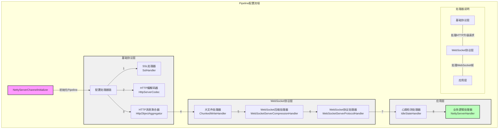
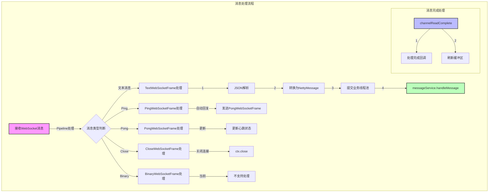
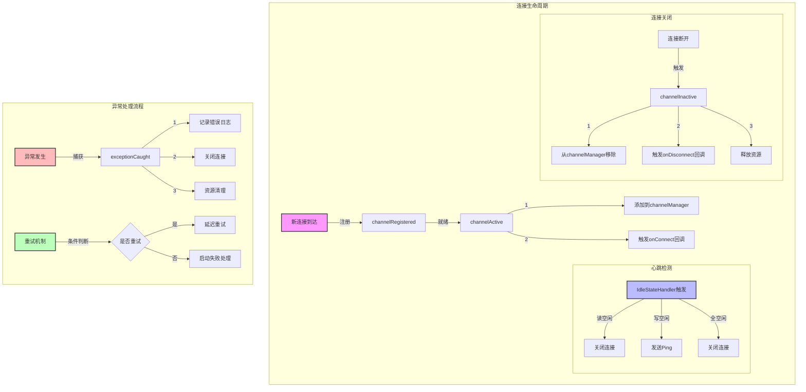
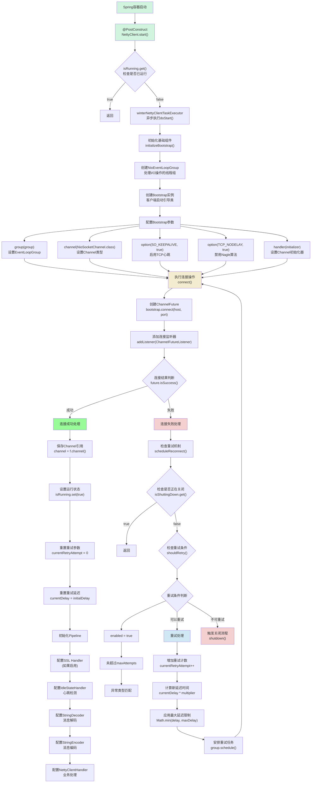
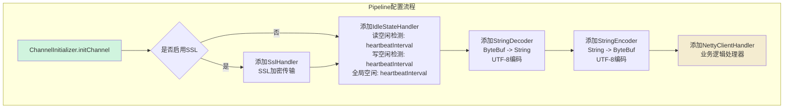
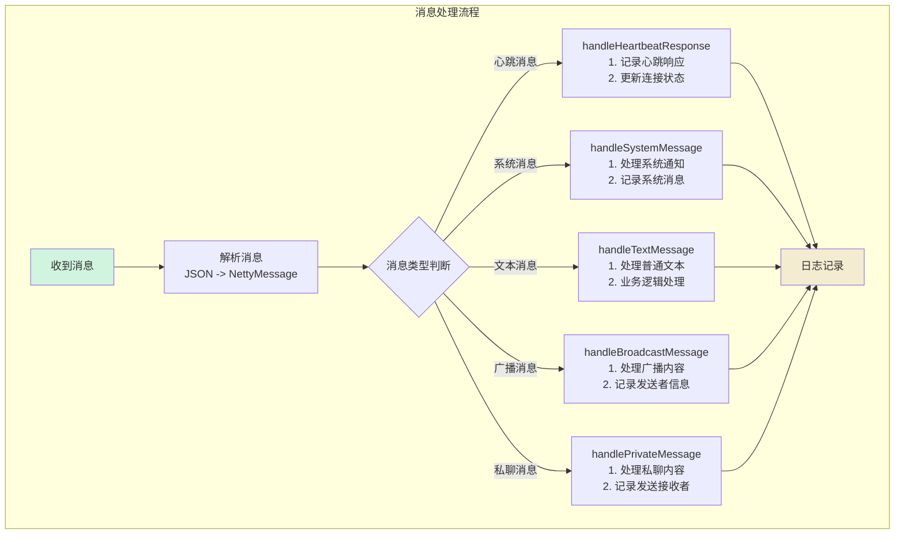
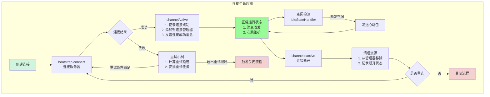
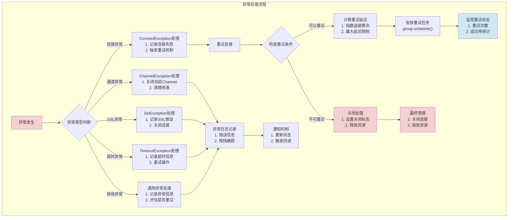

服务端启动的流程图
```mermaid
graph TD
    A[Spring容器启动] -->|@PostConstruct| B[NettyServer.start]
    B -->|异步执行| C[NettyServer.doStart]
    C -->|调用| D[NettyServer.startServer]
    
    D -->|初始化| E[NettyServer.initializeServer]
    
    E -->|1| F[创建线程组]
    F -->|1.1| F1[创建BossGroup]
    F -->|1.2| F2[创建WorkerGroup]
    
    E -->|2| G[配置ServerBootstrap]
    G -->|2.1| G1[设置线程组]
    G -->|2.2| G2[设置Channel类型]
    G -->|2.3| G3[配置childHandler]
    G -->|2.4| G4[配置TCP参数]
    
    G3 -->|初始化Pipeline| H[NettyServerChannelInitializer]
    H -->|添加处理器| H1[SSL处理器]
    H -->|添加处理器| H2[HTTP编解码器]
    H -->|添加处理器| H3[HTTP消息聚合器]
    H -->|添加处理器| H4[大文件处理器]
    H -->|添加处理器| H5[WebSocket压缩处理器]
    H -->|添加处理器| H6[WebSocket协议处理器]
    H -->|添加处理器| H7[心跳检测处理器]
    H -->|添加处理器| H8[业务逻辑处理器]
    
    E -->|3| I[绑定端口]
    I -->|3.1| I1[创建ServerChannel]
    I -->|3.2| I2[等待绑定完成]
    
    E -->|4| J[启动完成处理]
    J -->|4.1| J1[重置重试计数]
    J -->|4.2| J2[完成startupFuture]
    J -->|4.3| J3[输出启动日志]
    
    K[异常处理机制]
    D -->|异常发生| K
    K -->|重试条件满足| L[重试处理]
    L -->|延迟等待| D
    K -->|重试条件不满足| M[启动失败处理]
    
    N[优雅关闭机制]
    N -->|1| N1[关闭ServerChannel]
    N -->|2| N2[关闭WorkerGroup]
    N -->|3| N3[关闭BossGroup]
    
    style A fill:#f9f,stroke:#333,stroke-width:2px
    style E fill:#bbf,stroke:#333,stroke-width:2px
    style H fill:#bfb,stroke:#333,stroke-width:2px
    style K fill:#fbb,stroke:#333,stroke-width:2px
    style N fill:#fbf,stroke:#333,stroke-width:2px
```


Pipeline 配置流程：


消息处理流程：


连接生命周期和异常处理：




客户端启动

Pipeline配置流程

消息处理流程：

连接生命周期：



异常处理流程：


自定义WebSocket消息服务实现示例

```java
/**
 * 自定义WebSocket消息服务实现示例
 * 用户可以通过实现WebSocketMessageService接口来自定义消息处理逻辑
 */
@Service
public class CustomWebSocketMessageService implements WebSocketMessageService {
    
    private static final Logger logger = LoggerFactory.getLogger(CustomWebSocketMessageService.class);
    
    @Autowired
    private WebSocketChannelManager channelManager;
    
    private final ObjectMapper objectMapper = new ObjectMapper();
    
    @Override
    public void handleMessage(Channel channel, WebSocketMessage message) {
        logger.info("自定义处理WebSocket消息 - 通道: {}, 消息: {}", channel.id(), message);
        
        try {
            switch (message.getType()) {
                case TEXT:
                    handleTextMessage(channel, message);
                    break;
                case HEARTBEAT:
                    handleHeartbeat(channel, message);
                    break;
                case SYSTEM:
                    handleSystemMessage(channel, message);
                    break;
                case BROADCAST:
                    handleBroadcastMessage(channel, message);
                    break;
                case PRIVATE:
                    handlePrivateMessage(channel, message);
                    break;
                default:
                    logger.warn("未知消息类型: {}", message.getType());
                    sendErrorMessage(channel, "不支持的消息类型: " + message.getType());
            }
        } catch (Exception e) {
            logger.error("处理WebSocket消息失败", e);
            sendErrorMessage(channel, "消息处理失败");
        }
    }
    
    @Override
    public void onConnect(Channel channel) {
        logger.info("用户连接 - 通道ID: {}", channel.id());
        
        // 记录连接信息
        channelManager.addChannel(channel);
        
        // 发送欢迎消息
        WebSocketMessage welcomeMessage = WebSocketMessage.system("欢迎连接到WebSocket服务");
        sendMessage(channel, welcomeMessage);
        
        // 可以在这里添加其他连接时的处理逻辑，比如：
        // - 用户在线状态更新
        // - 连接统计
        // - 安全验证等
    }
    
    @Override
    public void onDisconnect(Channel channel) {
        logger.info("用户断开连接 - 通道ID: {}", channel.id());
        
        // 清理用户绑定
        String userId = channelManager.getUserIdByChannel(channel);
        if (userId != null) {
            channelManager.unbindUser(userId);
            logger.info("用户 {} 已断开连接并解绑", userId);
        }
        
        // 移除通道
        channelManager.removeChannel(channel);
        
        // 可以在这里添加其他断开连接时的处理逻辑，比如：
        // - 用户离线状态更新
        // - 清理用户相关数据
        // - 通知其他用户等
    }
    
    /**
     * 处理文本消息
     */
    private void handleTextMessage(Channel channel, WebSocketMessage message) {
        String content = message.getContent();
        
        // 示例：如果消息内容是"login:用户ID"，则绑定用户
        if (content != null && content.startsWith("login:")) {
            String userId = content.substring(6);
            handleUserLogin(channel, userId);
        }
        // 示例：如果消息内容是"logout"，则解绑用户
        else if ("logout".equals(content)) {
            handleUserLogout(channel);
        }
        // 其他文本消息处理
        else {
            logger.info("收到文本消息: {}", content);
            // 可以在这里添加其他文本消息处理逻辑
            // 比如聊天消息、命令处理等
        }
    }
    
    /**
     * 处理用户登录
     */
    private void handleUserLogin(Channel channel, String userId) {
        try {
            // 检查用户是否已经登录
            if (channelManager.getUserIdByChannel(channel) != null) {
                sendErrorMessage(channel, "用户已登录，请勿重复登录");
                return;
            }
            
            // 绑定用户
            channelManager.bindUser(userId, channel);
            
            // 发送登录成功消息
            WebSocketMessage response = WebSocketMessage.system("登录成功");
            response.setToUserId(userId);
            sendMessage(channel, response);
            
            logger.info("用户 {} 登录成功", userId);
            
        } catch (Exception e) {
            logger.error("处理用户登录失败", e);
            sendErrorMessage(channel, "登录处理失败");
        }
    }
    
    /**
     * 处理用户登出
     */
    private void handleUserLogout(Channel channel) {
        try {
            String userId = channelManager.getUserIdByChannel(channel);
            if (userId != null) {
                channelManager.unbindUser(userId);
                
                WebSocketMessage response = WebSocketMessage.system("登出成功");
                sendMessage(channel, response);
                
                logger.info("用户 {} 登出成功", userId);
            } else {
                sendErrorMessage(channel, "用户未登录");
            }
        } catch (Exception e) {
            logger.error("处理用户登出失败", e);
            sendErrorMessage(channel, "登出处理失败");
        }
    }
    
    /**
     * 处理心跳消息
     */
    private void handleHeartbeat(Channel channel, WebSocketMessage message) {
        // 回复心跳
        WebSocketMessage pong = WebSocketMessage.heartbeat();
        pong.setContent("pong");
        sendMessage(channel, pong);
        
        logger.debug("处理心跳消息，通道: {}", channel.id());
    }
    
    /**
     * 处理系统消息
     */
    private void handleSystemMessage(Channel channel, WebSocketMessage message) {
        logger.info("收到系统消息: {}", message.getContent());
        
        // 可以在这里处理系统级别的消息，比如：
        // - 用户认证
        // - 权限验证
        // - 系统通知
        // - 配置更新等
        
        String content = message.getContent();
        if ("ping".equals(content)) {
            // 系统级心跳检测
            WebSocketMessage response = WebSocketMessage.system("pong");
            sendMessage(channel, response);
        } else if ("status".equals(content)) {
            // 返回连接状态
            String userId = channelManager.getUserIdByChannel(channel);
            String status = userId != null ? "已登录用户: " + userId : "未登录";
            WebSocketMessage response = WebSocketMessage.system(status);
            sendMessage(channel, response);
        }
    }
    
    /**
     * 处理广播消息
     */
    private void handleBroadcastMessage(Channel channel, WebSocketMessage message) {
        logger.info("处理广播消息: {}", message.getContent());
        
        // 可以在这里添加广播消息的业务逻辑，比如：
        // - 消息过滤
        // - 权限检查
        // - 消息审核
        // - 广播范围控制等
        
        String userId = channelManager.getUserIdByChannel(channel);
        if (userId == null) {
            sendErrorMessage(channel, "请先登录后再发送广播消息");
            return;
        }
        
        // 设置发送者信息
        message.setFromUserId(userId);
        
        try {
            // 广播给所有在线用户
            channelManager.broadcastMessage(objectMapper.writeValueAsString(message));
            logger.info("用户 {} 发送广播消息成功", userId);
        } catch (Exception e) {
            logger.error("广播消息失败", e);
            sendErrorMessage(channel, "广播消息发送失败");
        }
    }
    
    /**
     * 处理私聊消息
     */
    private void handlePrivateMessage(Channel channel, WebSocketMessage message) {
        logger.info("处理私聊消息: {}", message.getContent());
        
        String fromUserId = channelManager.getUserIdByChannel(channel);
        String toUserId = message.getToUserId();
        
        if (fromUserId == null) {
            sendErrorMessage(channel, "请先登录后再发送私聊消息");
            return;
        }
        
        if (toUserId == null || toUserId.trim().isEmpty()) {
            sendErrorMessage(channel, "请指定接收者用户ID");
            return;
        }
        
        // 设置发送者信息
        message.setFromUserId(fromUserId);
        
        try {
            // 发送给指定用户
            boolean success = channelManager.sendToUser(toUserId, objectMapper.writeValueAsString(message));
            
            if (success) {
                logger.info("用户 {} 向用户 {} 发送私聊消息成功", fromUserId, toUserId);
                
                // 向发送者确认消息已发送
                WebSocketMessage confirmMessage = WebSocketMessage.system("私聊消息发送成功");
                sendMessage(channel, confirmMessage);
            } else {
                sendErrorMessage(channel, "接收者不在线或不存在");
            }
        } catch (Exception e) {
            logger.error("发送私聊消息失败", e);
            sendErrorMessage(channel, "私聊消息发送失败");
        }
    }
    
    /**
     * 发送消息到指定通道
     */
    private void sendMessage(Channel channel, WebSocketMessage message) {
        try {
            String jsonMessage = objectMapper.writeValueAsString(message);
            channelManager.sendToChannel(channel, jsonMessage);
        } catch (Exception e) {
            logger.error("发送消息到通道失败", e);
        }
    }
    
    /**
     * 发送错误消息
     */
    private void sendErrorMessage(Channel channel, String errorMsg) {
        WebSocketMessage errorMessage = WebSocketMessage.system("错误: " + errorMsg);
        sendMessage(channel, errorMessage);
    }
}
```

# Winter Netty Spring Boot Starter

一个简单易用的 Spring Boot Starter，用于快速集成基于 Netty 的 WebSocket 服务器和客户端。支持服务端和客户端双向通信、心跳检测、SSL/TLS加密、消息压缩等特性。

## 功能特点

- 🚀 快速集成：一键启用 WebSocket 服务端或客户端
- 🔐 安全通信：支持 SSL/TLS 加密（支持自定义证书和自签名证书）
- 💗 心跳检测：自动的连接活性检测和维护
- 🔄 自动重连：客户端断线自动重连，支持指数退避策略
- 📦 消息压缩：支持 WebSocket 消息压缩，减少传输数据量
- 🎯 灵活路由：支持多种消息类型（文本、广播、私聊等）
- 🎨 优雅设计：完善的生命周期管理和异常处理
- 📈 性能优化：使用线程池处理业务逻辑，避免阻塞IO线程

## 快速开始

### 1. 添加依赖

在你的 Spring Boot 项目的 pom.xml 中添加以下依赖：

```xml
<dependency>
    <groupId>com.zsq.winter</groupId>
    <artifactId>winter-netty-spring-boot-starter</artifactId>
    <version>${latest.version}</version>
</dependency>
```

### 2. 配置属性

在 application.yml 或 application.properties 中添加相关配置：

```yaml
netty:
  # 是否启用服务端组件
  enable-server: true
  # 是否启用客户端组件
  enable-client: false
  
  # 服务端配置
  server:
    # 服务端口
    port: 8888
    # WebSocket路径
    path: /websocket
    # 最大连接数
    max-connections: 1000
    # 最大帧长度
    max-frame-size: 65536
    # 心跳间隔(秒)
    heartbeat-interval: 30
    # Boss线程数
    boss-threads: 1
    # Worker线程数（0表示使用CPU核心数*2）
    worker-threads: 0
    # 是否启用SSL
    ssl-enabled: false
    # SSL证书路径
    ssl-cert-path: 
    # SSL私钥路径
    ssl-key-path: 
    
    # 服务端线程池配置
    thread-pool:
      core-pool-size: 10
      max-pool-size: 100
      queue-capacity: 1000
      keep-alive-seconds: 60
      name-prefix: winterNettyServer-
      await-termination-seconds: 60
      wait-for-tasks-to-complete-on-shutdown: true
    
    # 重试配置
    retry:
      enabled: true
      max-attempts: 3
      initial-delay: 1
      max-delay: 30
      backoff-multiplier: 2.0

  # 客户端配置
  client:
    # 服务器地址
    host: localhost
    # 服务器端口
    port: 8888
    # 最大重连次数
    max-retry-attempts: 3
    # 重连延迟（秒）
    reconnect-delay: 5
    # 心跳间隔（秒）
    heartbeat-interval: 30
    # 是否启用SSL
    ssl-enabled: false
    # SSL证书路径
    ssl-cert-path:
    # SSL私钥路径
    ssl-key-path:
    # SSL信任证书路径
    ssl-trust-cert-path:
    
    # 客户端线程池配置
    thread-pool:
      core-pool-size: 5
      max-pool-size: 50
      queue-capacity: 500
      keep-alive-seconds: 60
      name-prefix: winterNettyClient-
      await-termination-seconds: 60
      wait-for-tasks-to-complete-on-shutdown: true
```

### 3. 服务端使用示例

#### 3.1 实现自定义消息处理服务

```java
@Service
public class CustomMessageService implements NettyMessageService {
    @Override
    public void handleMessage(Channel channel, NettyMessage message) {
        // 处理接收到的消息
        switch (message.getType()) {
            case TEXT:
                // 处理文本消息
                break;
            case BROADCAST:
                // 处理广播消息
                break;
            case PRIVATE:
                // 处理私聊消息
                break;
            // ... 处理其他类型消息
        }
    }

    @Override
    public void onConnect(Channel channel) {
        // 处理客户端连接事件
    }

    @Override
    public void onDisconnect(Channel channel) {
        // 处理客户端断开连接事件
    }
}
```

#### 3.2 使用消息推送服务

```java
@Service
public class MessagePushService {
    @Autowired
    private NettyPushTemplate pushTemplate;

    // 发送私聊消息
    public void sendPrivateMessage(String userId, String content) {
        pushTemplate.pushToUser(userId, content);
    }

    // 发送广播消息
    public void broadcast(String content) {
        pushTemplate.broadcast(content);
    }

    // 发送带额外数据的消息
    public void sendWithExtra(String userId, String content, Map<String, Object> extra) {
        pushTemplate.pushToUser(userId, content, extra);
    }

    // 检查用户在线状态
    public boolean isUserOnline(String userId) {
        return pushTemplate.isUserOnline(userId);
    }

    // 获取在线用户数
    public int getOnlineCount() {
        return pushTemplate.getOnlineUserCount();
    }
}
```

### 4. 客户端使用示例

#### 4.1 注入并使用客户端

```java
@Service
public class NettyClientService {
    @Autowired
    private NettyClient nettyClient;

    public void sendMessage(String message) {
        nettyClient.sendMessage(message);
    }

    public void sendMessage(NettyMessage message) {
        nettyClient.sendMessage(message);
    }
}
```

### 5. 消息类型说明

支持的消息类型包括：

- TEXT: 普通文本消息
- HEARTBEAT: 心跳消息
- SYSTEM: 系统消息
- BROADCAST: 广播消息
- PRIVATE: 私聊消息

消息格式示例：

```json
{
    "messageId": "unique-message-id",
    "type": "TEXT",
    "fromUserId": "sender-id",
    "toUserId": "receiver-id",
    "content": "Hello, World!",
    "extra": {
        "key1": "value1",
        "key2": "value2"
    },
    "timestamp": "2024-03-20 12:34:56"
}
```

## 高级特性

### SSL/TLS 配置

1. 使用自定义证书：

```yaml
netty:
  server:
    ssl-enabled: true
    ssl-cert-path: /path/to/server.crt
    ssl-key-path: /path/to/server.key
```

2. 客户端SSL配置：

```yaml
netty:
  client:
    ssl-enabled: true
    ssl-trust-cert-path: /path/to/ca.crt
```

### 自定义线程池配置

可以根据业务需求调整线程池参数：

```yaml
netty:
  server:
    thread-pool:
      core-pool-size: 20
      max-pool-size: 200
      queue-capacity: 2000
```

### 重试策略配置

支持灵活的重试策略配置：

```yaml
netty:
  server:
    retry:
      enabled: true
      max-attempts: 3
      initial-delay: 1
      max-delay: 30
      backoff-multiplier: 2.0
```

## 注意事项

1. 服务端和客户端可以同时启用，也可以单独使用
2. 建议根据实际需求调整线程池参数
3. 生产环境建议使用自定义SSL证书
4. 注意合理配置心跳间隔，避免过于频繁
5. 大规模部署时注意调整最大连接数和线程池参数

## 常见问题

1. Q: 如何处理连接断开重连？
   A: 客户端会自动进行重连，可以通过配置 `max-retry-attempts` 和 `reconnect-delay` 调整重连策略。

2. Q: 如何实现自定义的消息处理？
   A: 实现 `NettyMessageService` 接口，并注册为 Spring Bean。

3. Q: 如何确保消息可靠送达？
   A: 可以在消息中添加确认机制，或使用消息ID进行跟踪。

## 贡献指南

欢迎提交 Issue 和 Pull Request。在提交 PR 前，请确保：

1. 代码符合项目规范
2. 添加必要的测试用例
3. 更新相关文档

## 许可证

[Apache License 2.0](LICENSE)